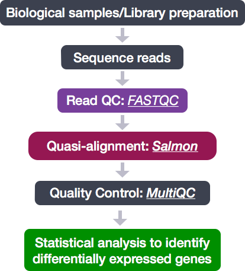
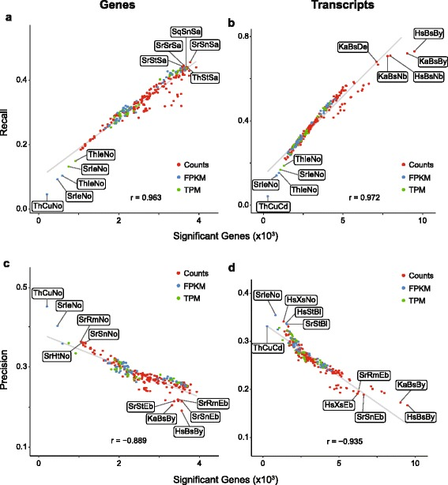

> Overview
> --------
> **Questions**
> 
> *  How do I perform pseudo-alignment to map the transcriptome of my sample?
>     
> 
> **Objectives**
> 
> *   Understand the difference between pseudo-alignment and alignment
>     
> *  Select the correct parameters for kallisto for your sample
>     
> *  Submit your job to the cluster

Introduction
==============
Despite challenges of RNA-seq, it is a very useful experiment and researchers have worked through many of the challenges above to develop software that can help us infer what is happening in the transcriptome.

Kallisto is a quick, highly-efficient software for quantifying transcript abundances in an RNA-Seq experiment. Even on a typical laptop, Kallisto can quantify 30 million reads in less than 3 minutes.

Pseudoalignment and Genomics Word Search Explained
=====================================================
Alignment of reads is an expansive topic. Several reviews cover some of the important topics including [Stark et. al. 2019](https://www.nature.com/articles/s41576-019-0150-2). This [blog post](http://tinyheero.github.io/2015/09/02/pseudoalignments-kallisto.html) and the [kallisto paper](https://www.nature.com/articles/nbt.3519) are further readings to get a deep understanding of the subject.

To try and reduce this problem to its most basic, the Leo Pachter Lab used an analogy. 

In the traditional case, when software does alignment, it tries to match a read to the genome.
 
>
>       Genome: ACTACGTAGCCGTCAAATATCCCGGGTATCGTACGATCGACGT
>
>       Read:   AAATTTCCCGGG
>       
  
If we move things around we can find the match:

>
>       Genome: ACTACGTAGCCGTCAAATATCCCGGGTATCGTACGATCGACGT
>
>                       |||| |||||||
>
>       Read:           AAATTTCCCGGG
>  
 
  
In this example, we have one mismatch. Although finding this match was simple, the genome is far more complex.

In the word search below is the word “DNA”. Can you find it? It may take you a while. Searching for words is a process similar to taking sequencing reads and trying to match them to the genome. Computers are fast, but just as matching a small word (3 letters) in a large (1639 letter) word puzzle is time-intensive, it take a long time to match millions of short reads against genomes of billions of nucleotides.

>CUSVFVMAASJFHUTMNCCQMBVXOLBEETYHSRBWOSEY
>MOBJEYXAZMPMFENZHQKMHHSCZUXUQYEBQONJVYWH
>LCMIFVSPNMAGIJAOOFCWNYYDETTLMGCDOBSLOPXO
>ZAUSKOGLCYOIKIXZSHOXHLYGZJLRLZMRGHRFRJWN
>HBEOJQLIXUYAIAWMJASRBOVSBHMAHJFPUOXTQIYZ
>LSSCVOGPJCIIMUILZCFKLASLFLQFIZVSYXWJYNMJ
>QPWLYGLRTSTQHYUVFVGGPDMICLGDUMZOVPHFPLOD
>YFZAYPVONRRCPHJPNJVROZEZPBLZNYBQHOVUPOGJ
>SAVCNZWIYQKHJOLKQBHZYGJZKUEHKJLCLXOLMUJF
>YJAGKRFQOQRNAXXXZAZUMMWMLKWNREHDFOLVVYWK
>ATOXWLBGQECNAMWJIMONGSAVKGSHUVUOROVJRJGT
>AJLVEYWLSFPUIYABELQZLYLUGZJGPGWEVPXYCHGO
>IPXOCIPREEDCYTFZHBDTTOIJRWLEYEMMTRIDSMGJ
>BNEZKUNVOXZFIXAAGGYUWAYZSNVUHXJZMMPXBPTE
>QMVXMUJAFUGBBLAVVCGVBDIGDBIDBSHTEVPCJTUB
>ELJIPXDVTMPNCROAPIHZMROJXZFCDHRYWIEUSZST
>ERRCPCLAPIJROAAUKZNDYYKNWKNUNFDKSTLYTXKA
>UAMNKGZVKWMOYGLLWUJOECUNBRUGRPWWUNNVEXYF
>MQYPHTEPNKPLWECXVORINUEHHVLVBNFUJJXNEZYT
>MJDQTZMIRJXMLYUCXYCVFQHHQBERSMGQLRWNYAJP
>IELYQQDAIXJDTUONASHBTLCZISHQWCMJZFAFJOXE
>UGZWMJGDLLRKIZVVLPHYBCULVCAIRMMEQPRRHFHQ
>FFCWSFSQZJTBCVFHUAEECJPXKHMKRKJFBZVQNOMZ
>ZZZEMQQNVWUXDOYBDHSDFLHMAQEWFKWPMIGJVZUT
>ZNEQDNAHXMPBLRVDEBJRJFTDOIWUPFLSIYOOHNQH
>TTMIXMVUMETGMJWFEWCRITKZWZGVMCNQRAPDCJZD
>AXPTCGYNKVFDPALHRQNPKQUBSEGOOQCVUDDHTIWR
>GEMJXKJGSSRAROGDWETVVTZMWUSCYXIKTUFLUIXO
>BDZFSFRPFXHALCKUGTOHGMEHYPRPTFXUSWSKDBWC
>UGGJXCDKYYZZFLDAWLDYJLCRSTDSMLOGPCVAUDZZ
>AHGKHDAGOHYQDKGWDTOGFVOSRKJCPRRENRQRBBPQ
>ABHWPOFZYTGHXPREABCTWABQLZLYBOQVHOMUHGRS
>FPNWCEQGTYJEDRWAVDYKUAZMLVVNTYNRZHPFHYGR
>UAJNXZWZSBLEVYIGLRPFNZLOGRULAHIAHDLXTJXF
>DQEKRQNVJACCBVGABSKTWRPYEFXNEHSICVLHWOIV
>GVOGZWUSLGRGHMVENEYNSBCZRLOZYCMXCYGWUMSG
>LFXDWDWHJYXAXDVWVMTPKQVTAYHNCADYJCNKNDZM
>ASJBGHYSPRUIIVQDAVUQBEEDNQKBKQPMKYQKRIKV
>MWFHPISMEIUIVZVBEUKTFOUADMUDXAJSGYHLXUSP
>OSIVVLZMDTLDMCLGZLEGWLPVPWOLNERAINTAESFR
 
Pseudoalignment is one approach to this computational “word search”. It takes advantage of a trick to speed up performance without loosing accuracy. Take the second line in our “DNA” word search puzzle:

>MOBJEYXAZMPMFENZHQKMHHSCZUXUQYEBQONJVYWH

There is no “D” in this line. True, We don’t know that until we read the entire line, but once we realize this line can’t possible be a match without a “D” We can ignore this line. Word search puzzles don’t have to be read in just one direction (words might be on diagonals, backwards, etc.), but now consider what happens in the pseudoalignment “word search”. In this case we are searching not the entire genome, but linear transcripts:

>Transcript 1: CUSVFVMAASJFHUTMNCCQMBVXOLBEETYHSRBWOSEY
>
>Transcript 2: MOBJEYXAZMPMFENZHQKMHHSCZUXUQYEBQONJVYWH
>
>Transcript 3: LCMIFVSPNMAGIJAOOFCWNYYDETTLMGCDOBSLOPXO
>
>Transcript 4: ZAUSKOGLCYOIKIXZSHOXHLYGZJLRLZMRGHRFRJWN
>
>Transcript 5: ZNEQDNAHXMPBLRVDEBJRJFTDOIWUPFLSIYOOHNQH

We can immediately eliminate transcripts that don’t contain the letter D:

>Transcript 3: LCMIFVSPNMAGIJAOOFCWNYYDETTLMGCDOBSLOPXO
>
>Transcript 5: ZNEQDNAHXMPBLRVDEBJRJFTDOIWUPFLSIYOOHNQH

Immediately, the problem is made easier by throwing away transcripts that could not contain the answer. This is not an exact analogy but basically, rather than trying to match every read to every position in the genome, Kallisto is faster because 1) we are only matching to the transcriptome (a subset of the genome) and 2) we focus only on transcripts that could have generated a particular read.

> Note
Pseudoalignment is just one approach to aligning RNA-Seq reads. Other software will do full alignments of the read to a transcriptome or genome. These methods have different advantages and requirements.

## Lightweight alignment and quantification of gene expression

This strategy for quantification is called transcriptome mapping, and not splice-aware alignment. Tools that fall in this category include [Kallisto](https://pachterlab.github.io/kallisto/about), [Sailfish](http://www.nature.com/nbt/journal/v32/n5/full/nbt.2862.html) and [Salmon](https://combine-lab.github.io/salmon/); each working slightly different from one another. (For this workshop we will explore Kallisto in more detail.) 

Common to all of these tools is that **base-to-base alignment of the reads is avoided**, which is a time-consuming step, and these tools **provide quantification estimates much faster than do standard approaches** (typically more than 20 times faster) with **improvements in accuracy** at **the transcript level**. 

These transcript expression estimates, often referred to as 'pseudocounts', can be converted for use with DGE tools like DESeq2 (using [tximport](https://bioconductor.org/packages/release/bioc/html/tximport.html)) or the estimates can be used directly for isoform-level differential expression using a tool like [Sleuth](http://www.biorxiv.org/content/biorxiv/early/2016/06/10/058164.full.pdf). 

The improvement in accuracy for lightweight alignment tools in comparison with the standard alignment/counting methods primarily relates to the ability of the lightweight alignment tools to quantify multi mapping reads. 

| Read aligner | RA code | Expression modeler | EM code | Differential expression | DE code |
| ------------ | ------- | ------------------ | ------- | ----------------------- | ------- |
| Bowtie2      | Bw      | BitSeq             | Bs      | Ballgown                | Bl      |
| HISAT2       | Hs      | cufflinks          | Cu      | BitSeq                  | Bs      |
| Kallisto     | Ka      | htseq              | Ht      | baySeq                  | By      |
| Salmon-FMD   | Sf      | IsoEM              | Ie      | cuffdiff                | Cd      |
| Sailfish     | Sl      | kallisto           | Ka      | DESeq2                  | De      |
| SeqMap       | Sm      | RSEM               | Rm      | EBseq                   | Eb      |
| Salmon-Quasi | Sq      | rSeq               | Rs      | edgeR                   | Er      |
| STAR         | Sr      | Sailfish           | Sl      | limma + voom            | Lo      |
| TopHat2      | Th      | Salmon             | Sn      | limma + vst             | Lv      |
|              |         | STAR               | Sr      | NBPseq                  | Nb      |
|              |         | Stringtie          | St      | NOISeqBIO               | No      |
|              |         | eXpress            | Xs      | SAMseq                  | Sa      |
|              |         |                    |         | Sleuth                  | Su      |

This has been shown by Robert et. al by comparing the accuracy of 12 different alignment/quantification methods using simulated data to estimate the gene expression of 1000 perfect RNA-Seq read pairs from each of of the genes [[1](https://genomebiology.biomedcentral.com/articles/10.1186/s13059-015-0734-x)].

As shown in the figures below taken from the paper, the **standard alignment and counting methods such as STAR/htseq or Tophat2/htseq result in underestimates of many genes - particularly those genes comprised of multimapping reads** [[1](https://genomebiology.biomedcentral.com/articles/10.1186/s13059-015-0734-x)]. 

While the STAR/htseq standard method of alignment and counting is a bit conservative and can result in false negatives, **Cufflinks tends to overestimate gene expression and results in many false positives**, which is why Cufflinks is generally not recommended for gene expression quantification.

Finally, the most accurate quantification of gene expression was achieved using the lightweight alignment tool Sailfish (if used without bias correction).

Lightweight alignment tools such as Sailfish, Kallisto, and Salmon have generally been found to yield the most accurate estimations of transcript/gene expression. Salmon is considered to have some improvements relative to Sailfish, and it is considered to give very similar results to Kallisto. 

What is Kallisto?
==================

Kallisto is based on the philosophy of lightweight algorithms, which use the reference transcriptome (in FASTA format) and raw sequencing reads (in FASTQ format) as input, but do not align the full reads. These tools perform both mapping and quantification. Unlike most lightweight and standard alignment/quantification tools, **Kallisto has a flag that utilizes sample-specific bias models for transcriptome-wide abundance estimation**. Sample-specific bias models are helpful when needing to account for known biases present in RNA-Seq data including:

- GC bias
- positional coverage biases
- sequence biases at 5' and 3' ends of the fragments
- fragment length distribution
- strand-specific methods

If not accounted for, these biases can lead to unacceptable false positive rates in differential expression studies [[2](http://salmon.readthedocs.io/en/latest/salmon.html#quasi-mapping-based-mode-including-lightweight-alignment)]. The **Kallisto algorithm can learn these sample-specific biases and account for them in the transcript abundance estimates**. Kallisto is extremely fast at "mapping" reads to the transcriptome and often more accurate than standard approaches.

### How does Kallisto estimate transcript abundances?

Similar to standard base-to-base alignment approaches, the quasi-mapping approach utilized by Kallisto requires a reference index to determine the position and orientation information for where the fragments best map prior to quantification [[3](https://academic.oup.com/bioinformatics/article/32/12/i192/2288985/RapMap-a-rapid-sensitive-and-accurate-tool-for)]. 

Kallisto Input
======================
In order to analyze data with Kallisto we need several inputs:

1. Trimmed and filtered FASTQ files
2. **A Reference transcriptome**  This is a file that has the sequences for all the known expressed genes. Reference transcriptomes are usually available from repositories like Ensembl and NCBI. We will be using the human reference transcriptome. Unlike a genome, the transcriptome is only coding genes.

Step-by-Step Kallisto
======================
Analysis with Kallisto has two main steps:

| Step | Description     | Command                                         | Input                                                                | Output                                          |
| ---- | --------------- | ----------------------------------------------- | -------------------------------------------------------------------- | ----------------------------------------------- |
| 1    | Genome indexing | kallisto index <--index=> <transcriptome.fa.gz> | Reference transcriptome                                             | Kallisto index (no file extension)              |
| 2    | Pseudoalignment | kallisto quant sample.fa.gz                     | FASTQ (one per run of kallisto), kallisto index (from indexing step) | abundances.h5, abundances.tsv and run_info.json |
  

Step 1 Genome indexing for Kallisto
===================================
There are a few files we need to perform the first step of Kallisto

- Reference transcriptome: A file of all the known transcripts of the human genome
- Reference annotations: A file with information on the location and structure of the genes in the human genome and a file with chromosome details.
  
  
  

We will now use Kallisto's indexing function to prepare the transcriptome for analysis. The "Index" is a lookup table for the transcriptome that allows it to be more easily searched by Kallisto. First, let's organize our files by creating a new directory to hold our kallisto work.

    $ mkdir -p /share/ScratchGeneral/[your_ID]/rnaseq_tutorial/kallisto_human_ref/
 
First, we must download the reference files from (https://asia.ensembl.org/info/data/ftp/index.html) using `wget`

1. We will need the FASTA file of the cDNA sequence
(https://ftp.ensembl.org/pub/release-109/fasta/homo_sapiens/cdna/Homo_sapiens.GRCh38.cdna.all.fa.gz)

       $ wget https://ftp.ensembl.org/pub/release-109/fasta/homo_sapiens/cdna/Homo_sapiens.GRCh38.cdna.all.fa.gz
      
 OR, if the expected download time is ages please copy from the communal folder.
 
      $ scp /srv/scratch/babs3291/references/Homo_sapiens.GRCh38.cdna.all.fa.gz /share/ScratchGeneral/[your_ID]/rnaseq_tutorial/kallisto_human_ref/
      
2. We also will need the human GTF file, a file containing coordinates and descriptions for all gene names and locations - we will also download this from Ensembl. (https://ftp.ensembl.org/pub/release-109/gtf/homo_sapiens/Homo_sapiens.GRCh38.109.gtf.gz)  **not needed for index command**
  
        $ wget https://ftp.ensembl.org/pub/release-109/gtf/homo_sapiens/Homo_sapiens.GRCh38.109.gtf.gz 
        
 OR, if the expected download time is large, please copy from the communal folder.
 
        $ scp  /srv/scratch/babs3291/references/Homo_sapiens.GRCh38.109.gtf.gz /share/ScratchGeneral/[your_ID]/rnaseq_tutorial/kallisto_human_ref/
        
Also, must unzip the gtf above. This will take the gtf from being compressed to human readable.
        
        $ gunzip Homo_sapiens.GRCh38.109.gtf.gz 
      
First, we must load kallisto to our session using `module load` as this is not installed.

        $ module load centos6.10/pethum/kallisto/prebuilt/0.43.0

Next, run the indexing command. This prepares the transcriptome so that we can pseudoalign reads to it.

    $ cd /share/ScratchGeneral/[your_ID]/rnaseq_tutorial/
    $ kallisto index --index=transcriptome_Homo_sapiens_GRCh38 kallisto_human_ref/Homo_sapiens.GRCh38.cdna.all.fa.gz

Step 2 Pseudoalignment of reads with Kallisto
============================================
In this final step, we will run Kallisto on all of our files to quantify the reads. We will write a for loop to do this. Let's see once again our trimmed reads

Using your trimmed reads

    $ cd /share/ScratchGeneral/[your_ID]/rnaseq_tutorial/TRIMMED_FASTQ/
  
All instructions for the commands we are using are in the Kallisto manual: https://pachterlab.github.io/kallisto/manual. Since we are using single-read data, we need to provide information on the fragment length used for the library (200) and an estimate of the standard deviation for this value - here we will have to guess (20). 

We need to run Kallisto on all of your files. Run the command below on one of your files. 

Single-end:

    $ INPUT_FASTA="/share/ScratchGeneral/[your_ID]/rnaseq_tutorial/TRIMMED_FASTQ/SRR306844chr1_chr3.trimmed.fastq.gz"
 
    $ kallisto quant \
     --single\
     --threads=8\
     --index=[insert_location_your transcriptome]\
     --fragment-length=200\
     --sd=20\
     --output-dir=output\
     --genomebam\
     --gtf=Homo_sapiens.GRCh38.109.gtf ${INPUT_FASTA]
 
 
For paired-end reads, you need two files as input.

    $ INPUT_FASTA="/share/ScratchGeneral/[your_ID]/rnaseq_tutorial/TRIMMED_FASTA/SRR306844*.trimmed.fastq.gz"
 
    $ kallisto quant \
     --threads=8\
     --index=[insert_location_your_transcriptome] \
     --output-dir=output\
     --genomebam\
     --gtf=[insert_location_your_transcriptome]/Homo_sapiens.GRCh38.109.gtf ${INPUT_FASTA}
     
     
     
kallisto quant produces three output files by default:

- abundance.h5 is a HDF5 binary file containing run info, abundance esimates, bootstrap estimates, and transcript length information length. This file can be read in by sleuth
- abundance.tsv is a plaintext file of the abundance estimates. It does not contains bootstrap estimates. Please use the --plaintext mode to output plaintext abundance estimates. Alternatively, kallisto h5dump can be used to output an HDF5 file to plaintext. The first line contains a header for each column, including estimated counts, TPM, effective length.
- run_info.json is a json file containing information about the run
 
 Lets have a look at what the file contains a list of abundances (counts) shows. 

  ` head -n 100 abundance.tsv`
  
Next you will have to calculate an abundance.tsv file for every sample.

Step 3 For Loop to perform pseudoalignment of reads for every sample
========================================================================
Like when you performed trimming, you will need to first request enough computational resources through `qrsh`. Then you will have to run a for loop to loop through every sample fastq file. The loop you use is dependent on whether you are single end or paired end. 

If you have single-end reads. 

    $ ALIGNMENT="/share/ScratchGeneral/helkin/rnaseq_tutorial/ALIGNMENT/"
    $ mkdir ${ALIGNMENT}
    $ cd ${ALIGNMENT}
    $ for infile in /share/ScratchGeneral/[your_ID]/rnaseq_tutorial/TRIMMED_FASTA/*.trimmed.fastq.gz
          do
          base=$(basename ${infile} trimmed.fastq.gz)
          outdir="${base}"
          kallisto quant \
           --single\
           --threads=8\
           --index=[insert_location_your transcriptome]\
           --fragment-length=200\
           --sd=20\
           --output-dir=${outdir}\
           --gtf=[insert_location_your_reference_files]/Homo_sapiens.GRCh38.109.gtf ${infile}

      done
      

If you have paired-end reads. **Hint: check the string provided as the second part of the basename command matches the prefix of your infile**

     $ ALIGNMENT="/share/ScratchGeneral/helkin/rnaseq_tutorial/ALIGNMENT/"
     $ mkdir ${ALIGNMENT}
     $ cd ${ALIGNMENT}
     $ for infile in *_1.trimmed.fastq.gz
          do
          base=$(basename ${infile} _1.trimmed.fastq.gz)
          outdir="${base}"
          infiles="${base}*trimmed.fastq.gz"
          kallisto quant \
           --threads=8 \
           --index=/srv/scratch/z5342988/transcriptome_Homo_sapiens_GRCh38 \
           --output-dir=${outdir} \
           --gtf=[insert_location_your_transcriptome]/Homo_sapiens.GRCh38.109.gtf ${infiles}

      done

> Exercise
> --------
> Use kallisto quant to quantify all the transcriptome of your files. 
> **Hint** Be polite and request your turn in the (HPC) queue!
>  
  

> Bonus
> -------
> Using the referenced papers and other research materials you can find, what are some other software tools that could be used as an alternative to Kallisto in RNA-Seq? Do they require the same datasets as Kallisto does in order to run?

  
  Adapted from https://cyverse-leptin-rna-seq-lesson-dev.readthedocs-hosted.com
  and https://pachterlab.github.io/kallisto/manual and https://raw.githubusercontent.com/hbctraining/Intro-to-rnaseq-hpc-O2/master/lessons/08_salmon.md from Mary Piper and Meeta Mistry
  

