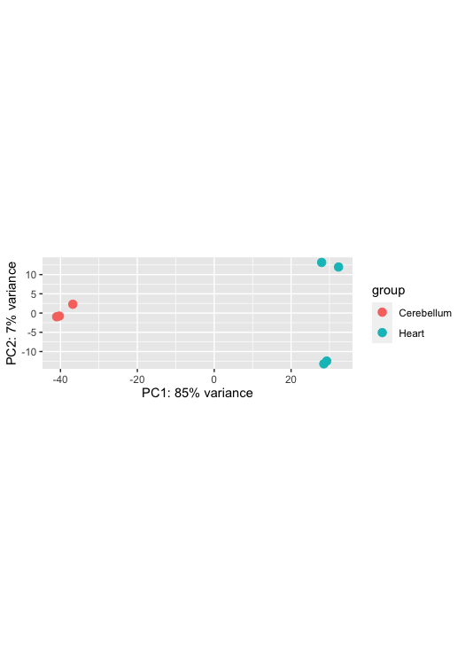
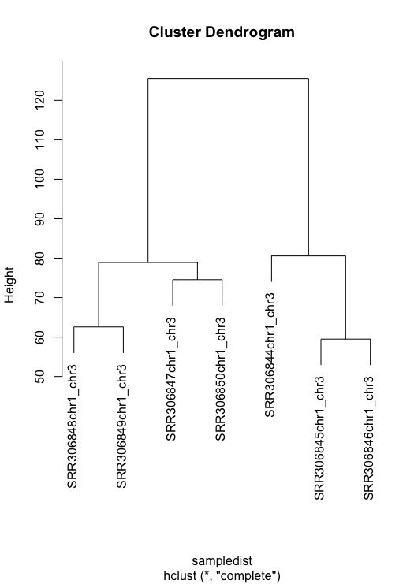
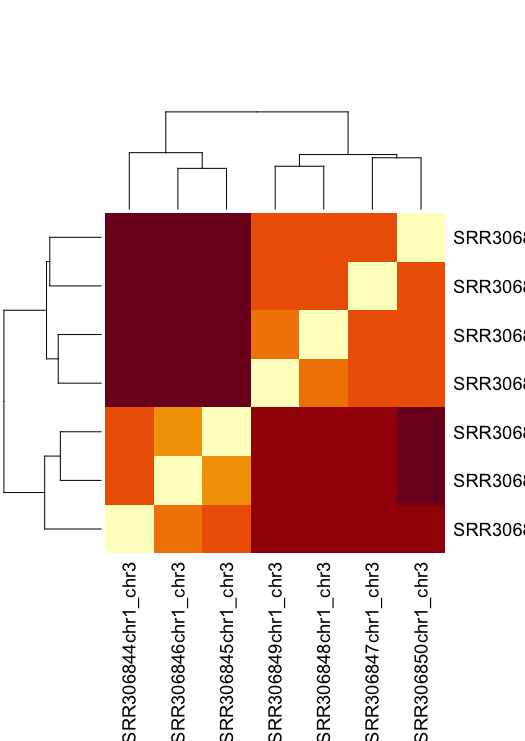
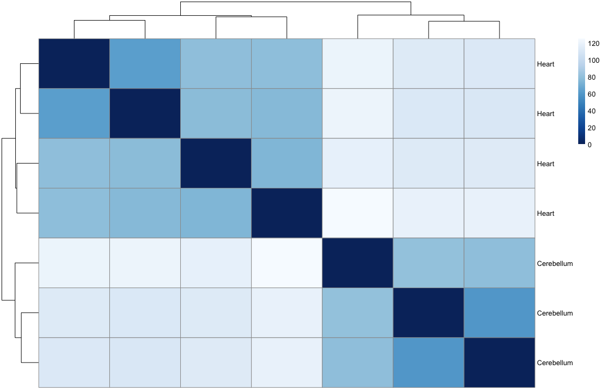
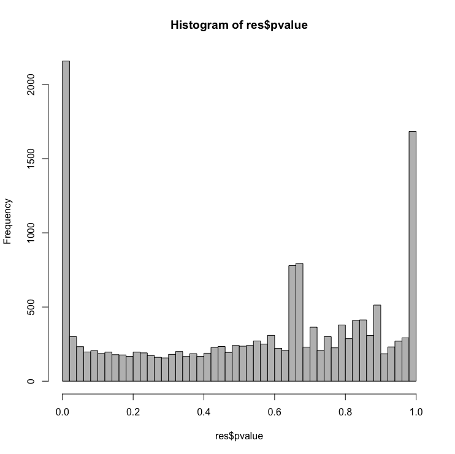
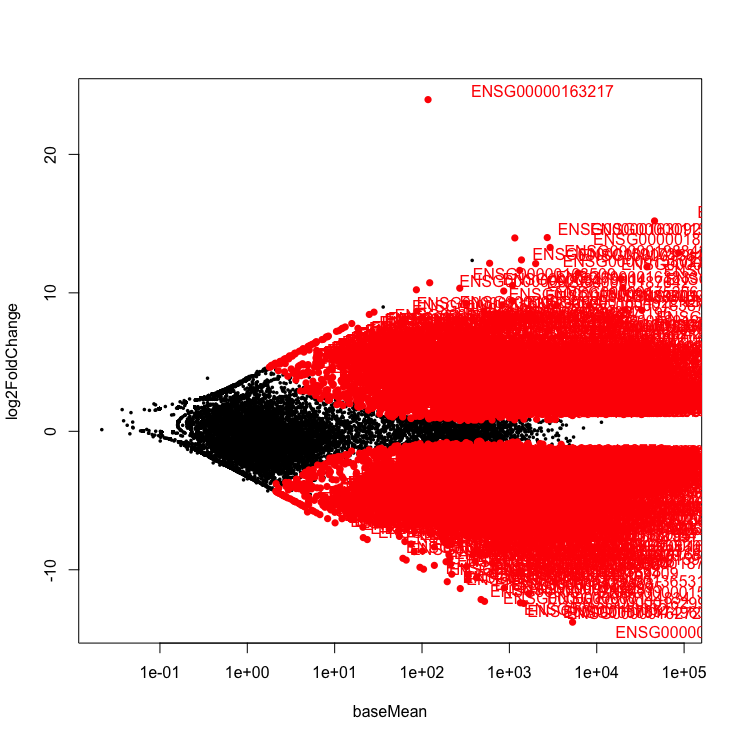

> Overview
> --------
> **Questions**
> 
> *   What are the top DEGs in our experiment? 
>     
> 
> **Objectives**
> 
> *   Use DESeq2 to output top differentially expressed genes  
>  
> *   Understand the best diagrams to show differentially expressed genes
> 

---------------------------------------

The next step in the RNA-seq workflow is the differential expression analysis. Differential expression testing aims to determine which genes are expressed at different levels between conditions. These genes can offer biological insight into the processes affected by the condition(s) of interest.

The steps outlined in the gray box below we have already discussed, and we will now continue to describe the steps in an **end-to-end gene-level RNA-seq differential expression workflow**.


So what does the count data actually represent? The count data used for differential expression analysis represents the number of sequence reads that originated from a particular gene. The higher the number of counts, the more reads associated with that gene, and the assumption that there was a higher gene expression level in the sample.


***Note: We are using features that are transcripts, not genes***

Counts and CPM
---------------
Kallisto counts the number of reads that align to one transcript. This is the *raw count*; however, normalisation is needed to make accurate comparisons of gene expression between samples. Normalisation is used to account for variabilities between or within *raw counts* due to technical differences such as read depth. The default in DEGUST is *Counts per million (CPM)*. CPM accounts for sequencing depth. This is not the best normalisation method for differential expression analysis between samples. However, we are not going to learn R in this course, so we have to work with what we have. 

Using DESeq
-------------
1. Opening up a project
2. Transferring locally
3. Install all packages
4. Import Kallisto output and metadata for DESeq analysis
5. Running DESeq
6. Taking into account confounding effects **(Extension)**


Opening up a project
---------------------
- Open up RStudio.
- Under the File menu, click on New project, choose New directory, then Empty project
- Enter a name for this new folder, and choose a convenient location for it. This will be your working directory for the rest of the day.
- Confirm that the folder named in the Create project as a sub-directory of the box is where you want the working directory created. Use the Browse button to navigate folders if changes are needed.
- Click on “Create project”
- Under the Files tab on the right of the screen, click on New Folder and create a folder named data within your newly created working directory. (e.g., ~/data-carpentry/data)
- Create a new R script (`File > New File > R script`) and save it in your working directory (e.g. data-carpentry-script.R)s
- We can open it by clicking the New File button or using the `Ctrl-Shift-N` keyboard shortcut (`Cmd-Shift-N`) on Mac

**Please be thoughtful about where you are saving your directory e.g. Desktop**


Transferring to a local computer
--------------------------------

Log onto the Wolfpack. Change the directory into the location that contains your aligned kallisto output `abundance.tsv`.

        $ ssh [yourID]@dice02.garvan.unsw.edu.au
        $ cd /share/ScratchGeneral/[yourID]/rnaseq_tutorial/ALIGNMENT/SRR306844chr1_chr3/
        $ ls abundance.tsv
      
This file contains the counts of one sample. For input into DESeq, you have to upload all the abundance.tsv files for every sample found in their respective folder.  

Logout off the cluster and stay on your laptop. 
You will now be transferring recursively downloading your files to your local computer. First move into a directory that you can access. 

        $  cd ~/Desktop/intro-to-rna-seq
        $  mkdir kallisto_output
        $  cd kallisto_output
        $  scp [yourID]@dice02.garvan.unsw.edu.au:"/share/ScratchGeneral/[yourID]/rnaseq_tutorial/kallisto_human_ref/Homo_sapiens.GRCh38.109.gtf" .
        $  rsync -r [yourID]@dice02.garvan.unsw.edu.au:"/share/ScratchGeneral/[yourID]/rnaseq_tutorial/ALIGNMENT/*chr1_chr3/" .

Please go to Sample Datasets and download the respective links for SraRunTable and SRR Acc List 

        $   wget https://raw.githubusercontent.com/theheking/babs-rna-seq/gh-pages/metadatafiles/SraRunTable_GSE30352.txt
        $   wget https://raw.githubusercontent.com/theheking/babs-rna-seq/gh-pages/metadatafiles/SRR_Acc_List_GSE30352.txt

Install and load packages
--------------------------
Back to your RStudio...

First, we'll need to install some add-on packages. Most generic R packages are hosted on the Comprehensive R Archive Network (CRAN, <http://cran.us.r-project.org/>). 

To install one of these packages, you would use `install.packages("packagename")`. You only need to install a package once, then load it each time using `library(packagename)`. 

```{r install_packages, eval=FALSE}
        install.packages("gplots")
        install.packages("calibrate")
```

Bioconductor packages work a bit differently, and are not hosted on CRAN. Go to <http://bioconductor.org/> to learn more about the Bioconductor project. To use any Bioconductor package, you'll need a few "core" Bioconductor packages. Run the following commands to (1) download the installer script, and (2) install some core Bioconductor packages. You'll need internet connectivity to do this, and it'll take a few minutes, but it only needs to be done once.

```{r bioclite, eval=FALSE}
        if (!require("BiocManager", quietly = TRUE))
            install.packages("BiocManager")
        
        BiocManager::install("tximport")
        BiocManager::install("DESeq2")
        BiocManager::install("GenomicFeatures")
        BiocManager::install("rhdf5")

```

To install specific packages, first download the installer script if you haven't done so, and use `biocLite("packagename")`. This only needs to be done once then you can load the package like any other package. Let's download the [DESeq2 package](http://www.bioconductor.org/packages/release/bioc/html/DESeq2.html):

Now let's load the packages we'll use:

```{r load_pkgs, eval=TRUE}
  
        library(DESeq2)
        library(gplots)
        library(calibrate)
        library(tximport)
        library(GenomicFeatures)
        library(rhdf5)

```


Uploading metadata and counts table to DESeq 
-----------------------------------------------

Let's import the metadata for the file. 

```
        
        metadata <- read.csv("~/Desktop/intro-to-rna-seq/kallisto_output/SraRunTable_GSE30352.txt")

```

We need to first load up the gtf file into R so that we can convert all the transcript IDs to gene IDs. 

```
        txdb <- makeTxDbFromGFF("/Users/helenking/Desktop/intro-to-rna-seq/kallisto_output/Homo_sapiens.GRCh38.109.gtf")
        k <- keys(txdb, keytype = "TXNAME")
        tx2gene <- select(txdb, k, "GENEID", "TXNAME")

```

Now let's create a list of all the files to load in. We need to convert the transcript to gene. 
```
        loc="~/Desktop/intro-to-rna-seq/kallisto_output/"
        files <- list.files(loc,pattern="abundance.h5",recursive=TRUE)
        files <- paste0(loc,files)
        check <- sapply(lapply(strsplit(files,"/"),tail,2),head,1)
        names(files) <- check
        txi.kallisto <- tximport(files, type = "kallisto",  tx2gene = tx2gene,ignoreTxVersion = TRUE)
```

The data.frame contains information about transcripts (one transcript per row) with the gene positions in the first five columns and then information about the number of reads aligning to the gene in each experimental sample. There are three replicates for control (column names starting with "ctl") and three for samples treated with ultraviolet-B light (starting "uvb"). We don't need the information on gene position for this analysis, just the counts for each gene and sample, so we can remove it from the data frame.

```
        rownames(metadata) <- colnames(txi.kallisto$counts)
        dds <- DESeqDataSetFromTximport(countData=txi.kallisto, colData=metadata, design=~source_name)
```

> Exercise 
> There's an R function called `rowSums()` that calculates the sum of each row in a numeric matrix, like the count matrix we have here, and it returns a vector. There's also a function called `which.max()` that determines the index of the maximum value in a vector.
> 1. Find the gene with the highest expression across all samples -- remember, each row is a gene.
> 2. Extract the expression data for this gene for all samples.
> 3. In which sample does it have the highest expression?
> 4. What is the function of the gene? Can you suggest why this is the top expressed gene?

```{r, echo=FALSE, include=FALSE}
        topGene <- which.max(rowSums(countdata))
        topGene
        countdata[topGene, ]
```

Next, let's run the DESeq pipeline on the dataset, and reassign the resulting object back to the same variable. Before we start, `dds` is a bare-bones DESeqDataSet. The `DESeq()` function takes a DESeqDataSet and returns a DESeqDataSet, but with lots of other information filled in (normalization, results, etc). Here, we're running the DESeq pipeline on the `dds` object, and reassigning the whole thing back to `dds`, which will now be a DESeqDataSet populated with results.

```{r run_deseq}
        dds <- DESeq(dds)
```

Now, let's use the `results()` function to pull out the results from the `dds` object. Let's re-order by the adjusted p-value.

```{r}
        # Get differential expression results
        res <- results(dds)
        head(res)
        
        # Order by adjusted p-value
        res <- res[order(res$padj), ]
        head(res)
```

Combine DEseq results with the original counts data. Write significant results to a file.

```{r write_results}
        sig <- subset(res, padj<0.05)
        dir.create("results")
        write.csv(sig, file="results/sig.csv") # tab delim data
```


## Data Visualization

We can also do some exploratory plotting of the data.

The differential expression analysis above operates on the raw (normalized) count data. But for visualizing or clustering data as you would with a microarray experiment, you need to work with transformed versions of the data. First, use a *regularized log* transformation while re-estimating the dispersion ignoring any information you have about the samples (`blind=TRUE`). 

Perform a principal components analysis and hierarchical clustering. PCA is a method to visualise the similarity or dissimilarity between each sample. We would expect the samples to cluster based on tissue. This is because we would expect the cerebellum samples to be more similar to each other than heart samples. In our MDS plot, we can see SRR306844chr1_chr3 clustering distinctly from all other samples. If not clustering well, it is an indicator of a contaminated sample or confounding factor not taken into account.

```{r}
        # Transform
        rld <- rlogTransformation(dds)
        
        # Principal components analysis
        plotPCA(rld, intgroup="source_name")
```




> Exercise
> ---------
> Research how to do an elbow plot for the PCA plotted above.
> 
> Make all the plots more aesthetically pleasing.
> 


```
        # Hierarchical clustering analysis
        ## let's get the actual values for the first few genes
        head(assay(rld))
        ## now transpose those
        t(head(assay(rld)))
        ## now get the sample distances from the transpose of the whole thing
        dist(t(assay(rld)))
        sampledist <- dist(t(assay(rld)))
        plot(hclust(sampledist))
```


Let's plot a heatmap that also visualised the similarity/dissimilarity across samples.

```{r plot_heatmaps}
        # ?heatmap for help
        sampledist
        as.matrix(sampledist)
        sampledistmat <- as.matrix(sampledist)
        heatmap(sampledistmat)
```


That's a horribly ugly default. You can change the built-in heatmap function, but others are better. 

```{r gplots_heatmap}
        # better heatmap with gplots
        heatmap.2(sampledistmat)
        heatmap.2(sampledistmat, key=FALSE, trace="none")
        colorpanel(10, "black", "white")

        heatmap.2(sampledistmat, col=colorpanel(64, "red", "white", "blue"), key=FALSE, trace="none")
```



> Exercise
> 
> Can you change values in the color panel to make the heatmap more colorblind friendly?
> 


Let's create a histogram of 

```{r plot_pval_hist}
        # Examine plot of p-values
        hist(res$pvalue, breaks=50, col="grey")
```


>Exercise
>
>Make a ggplot2 equivalent of the histogram above.
>

Let's plot an MA  plot. This shows the fold change versus the overall expression values. A MA-plot which is a scatter plot of log2 fold changes (M, on the y-axis) versus the average expression signal (A, on the x-axis). M = log2(x/y) and A = (log2(x) + log2(y))/2 = log2(xy)*1/2, where x and y are respectively the means of the two groups being compared, cerebellum and heart.


```{r MA_plot}
        with(res, plot(baseMean, log2FoldChange, pch=16, cex=.5, log="x"))
        with(subset(res, padj<.05), points(baseMean, log2FoldChange, col="red", pch=16))
        

        res$Gene <- rownames(res)
        head(res)
        with(subset(res, padj<.05), textxy(baseMean, log2FoldChange, labs=Gene, cex=1, col="red"))
```

Let's create a volcano plot. The volcano plot shows on shows the -log10pvalue (adjuted) against the logFC. The higher the value of the -log10pval, the greater the confidence in the log FC is not random.

```{r volcano_plot}
        par(pch=16)
        with(res, plot(log2FoldChange, -log10(pvalue), main="Volcano plot"))
        with(subset(res, padj<.05 ), points(log2FoldChange, -log10(pvalue), col="red"))
        with(subset(res, abs(log2FoldChange)>2), points(log2FoldChange, -log10(pvalue), col="orange"))
        with(subset(res, padj<.05 & abs(log2FoldChange)>2), points(log2FoldChange, -log10(pvalue), col="green"))

        # Add legend
        legend("topleft", legend=c("FDR<0.05", "|LFC|>2", "both"), pch=16, col=c("red","orange","green"))
        # Label points
        with(subset(res, padj<.05 & abs(log2FoldChange)>2), textxy(log2FoldChange, -log10(pvalue), labs=Gene, cex=1))
```
Every dot represents a gene (not an isoform). This is because we are using the transcriptome as the reference where each transcript name begins with “ENST”, we collapsed those counts from transcripts to gene. An example of a transcript that has a positive log FC due to being highly expressed in the heart, relative to the control cerebellum sample. It codes for a transcript of the gene, ENSG00000163217, [BMP10](http://asia.ensembl.org/Homo_sapiens/Gene/Summary?g=ENSG00000152977;r=3:147393422-147510293) which is a member of the secreted ligand of the TGF-beta (transforming growth factor-beta) superfamily of proteins that is key for embryonic cardiomyocyte proliferation.




> Exercise
>-----------
>
>  Read about multifactor designs in the [DESeq2 vignette](http://www.bioconductor.org/packages/release/bioc/vignettes/DESeq2/inst/doc/DESeq2.pdf) for cases where you have multiple variables of interest (e.g. irradiated vs controls in multiple tissue types).


Beginning section Edited from [Training-modules](https://github.com/hbctraining/Training-modules) 
