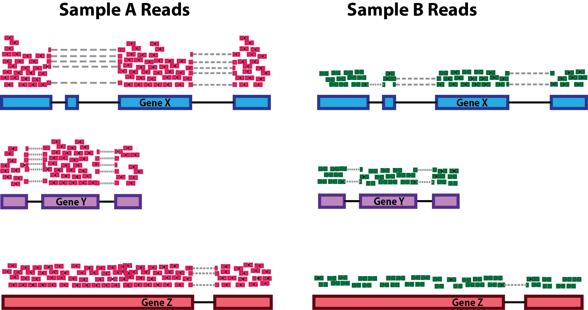

> Overview
> --------
>
> **Objectives**
> 
> *   Import all kallisto output into DESEq input
>  
> *   Understand the normalisation
> 

---------------------------------------

The next step in the RNA-seq workflow is the differential expression analysis. Differential expression testing aims to determine which genes are expressed at different levels between conditions. These genes can offer biological insight into the processes affected by the condition(s) of interest.

The steps outlined in the grey box below we have already discussed, and we will now continue to describe the steps in an **end-to-end gene-level RNA-seq differential expression workflow**.


So what does the count data actually represent? The count data used for differential expression analysis represents the number of sequence reads that originated from a particular gene. The higher the number of counts, the more reads associated with that gene, and the assumption that there was a higher gene expression level in the sample.


The schema above represents what has been calculated by Kallisto (except with transcripts). To summarise, the number of reads that map to a transcript in every sample across replciates in control (heart) and test (brain) groups. 
However, we need to calculate the comparisons between the two groups and determine which transcripts change significantly between conditions e.g. Gene A and Gene B, or not, e.g. Gene C.

This process is differential expression analysis. What is calculated at each stage includes:
1. Reads 
2. Normalisation with DESeq2's **median of ratio's**
3. Log fold change, p-value, FDR (false discovery rate) Next session


This is performed by:
1. Kallisto counts the number of reads that align to one transcript. This is the raw count, however, normalisation is needed to make accurate comparisons of gene expression between samples.
2. Normalisation accounts for variabilities between or within raw counts due to technical differences such as read depth. The default in DESeq2 is the median of ratios. We will explain more about this in the normalisation section.
3. Fold change is the change in n between conditions. Log Fold change is the logarithm of the fold change calculated.
A positive fold change indicates an increase in expression, and a negative fold change indicates a decrease in expression between the control (heart) and test (brain).
In my experiment, I expect the isoforms that regulate neuronal-related processes to be upregulated and the isoforms that regulate cardiac processes to be downregulated.


The picture attached shows that despite having the same log fold change, the lower p-value is correlated with lower intragroup variability. 
This means we can be more certain that the difference in fold change is significant.


Calculating the FDR is essential as we test significance across hundreds of genes and samples. A certain number of these log fold change calculations could have occurred by chance. However, by calculating the FDR, we can confidently identify the isoforms with differential expression between the brain and cerebellum.


Transferring to a local computer
--------------------------------

Log onto the Wolfpack. Change the directory into the location that contains your aligned kallisto output `abundance.tsv`.

        $ ssh [yourID]@dice02.garvan.unsw.edu.au
        $ cd /share/ScratchGeneral/[yourID]/rnaseq_tutorial/ALIGNMENT/SRR306844chr1_chr3/
        $ ls abundance.tsv
      
This file contains the counts of one sample. For input into DESeq, you have to upload all the abundance.tsv files for every sample found in their respective folder.  

Logout off the cluster and stay on your laptop. 
You will now be transferring recursively downloading your files to your local computer. First move into a directory that you can access. 

        $  cd ~/Desktop/intro-to-rna-seq
        $  mkdir kallisto_output
        $  cd kallisto_output
        $  scp [yourID]@dice02.garvan.unsw.edu.au:"/share/ScratchGeneral/[yourID]/rnaseq_tutorial/kallisto_human_ref/Homo_sapiens.GRCh38.109.gtf" .
        $  rsync -r [yourID]@dice02.garvan.unsw.edu.au:"/share/ScratchGeneral/[yourID]/rnaseq_tutorial/ALIGNMENT/*chr1_chr3/" .

Please go to Sample Datasets and download the respective links for SraRunTable and SRR Acc List 

        $   wget https://raw.githubusercontent.com/theheking/babs-rna-seq/gh-pages/metadatafiles/SraRunTable_GSE30352.txt
        $   wget https://raw.githubusercontent.com/theheking/babs-rna-seq/gh-pages/metadatafiles/SRR_Acc_List_GSE30352.txt


Normalization
-------------

The first step in the DE analysis workflow is count normalization, which is necessary to make accurate comparisons of gene expression between samples.

The counts of mapped reads for each gene is proportional to the expression of RNA (“interesting”) in addition to many other factors (“uninteresting”). Normalization is the process of scaling raw count values to account for the “uninteresting” factors. In this way the expression levels are more comparable between and within samples.

The main factors often considered during normalization are:

*   **Sequencing depth:** Accounting for sequencing depth is necessary for comparison of gene expression between samples. In the example below, each gene appears to have doubled in expression in _Sample A_ relative to _Sample B_, however this is a consequence of _Sample A_ having double the sequencing depth.
    
    
    
    > _**NOTE:** In the figure above, each pink and green rectangle represents a read aligned to a gene. Reads connected by dashed lines connect a read spanning an intron._
    
*   **Gene length:** Accounting for gene length is necessary for comparing expression between different genes within the same sample. In the example, _Gene X_ and _Gene Y_ have similar levels of expression, but the number of reads mapped to _Gene X_ would be many more than the number mapped to _Gene Y_ because _Gene X_ is longer.
    
    
    
*   **RNA composition:** A few highly differentially expressed genes between samples, differences in the number of genes expressed between samples, or presence of contamination can skew some types of normalization methods. Accounting for RNA composition is recommended for accurate comparison of expression between samples, and is particularly important when performing differential expression analyses \[[1](https://genomebiology.biomedcentral.com/articles/10.1186/gb-2010-11-10-r106)\].
    
    In the example, if we were to divide each sample by the total number of counts to normalize, the counts would be greatly skewed by the DE gene, which takes up most of the counts for _Sample A_, but not _Sample B_. Most other genes for _Sample A_ would be divided by the larger number of total counts and appear to be less expressed than those same genes in _Sample B_.
    
    
    

**_While normalization is essential for differential expression analyses, it is also necessary for exploratory data analysis, visualization of data, and whenever you are exploring or comparing counts between or within samples._**

### Common normalization methods

Several common normalization methods exist to account for these differences:


| Normalization method                                                                                                          | Description                                                                                                                  | Accounted factors                    | Recommendations for use                                                                                                 |
| ----------------------------------------------------------------------------------------------------------------------------- | ---------------------------------------------------------------------------------------------------------------------------- | ------------------------------------ | ----------------------------------------------------------------------------------------------------------------------- |
| **CPM** (counts per million)                                                                                                  | counts scaled by total number of reads                                                                                       | sequencing depth                     | gene count comparisons between replicates of the same samplegroup; **NOT for within sample comparisons or DE analysis** |
| **TPM** (transcripts per kilobase million)                                                                                    | counts per length of transcript (kb) per million reads mapped                                                                | sequencing depth and gene length     | gene count comparisons within a sample or between samples of the same sample group; **NOT for DE analysis**             |
| **RPKM/FPKM** (reads/fragments per kilobase of exon per million reads/fragments mapped)                                       | similar to TPM                                                                                                               | sequencing depth and gene length     | gene count comparisons between genes within a sample; **NOT for between sample comparisons or DE analysis**             |
| DESeq2’s **median of ratios** \[[1](https://genomebiology.biomedcentral.com/articles/10.1186/gb-2010-11-10-r106)\]            | counts divided by sample-specific size factors determined by median ratio of gene counts relative to geometric mean per gene | sequencing depth and RNA composition | gene count comparisons between samples and for **DE analysis**; **NOT for within sample comparisons**                   |
| EdgeR’s **trimmed mean of M values (TMM)** \[[2](https://genomebiology.biomedcentral.com/articles/10.1186/gb-2010-11-3-r25)\] | uses a weighted trimmed mean of the log expression ratios between samples                                                    | sequencing depth, RNA composition    | gene count comparisons between samples and for **DE analysis**; **NOT for within sample comparisons**                   |


Using DESeq
-------------
1. Opening up a project
2. Transferring locally
3. Install all packages
4. Import Kallisto output and metadata for DESeq analysis
5. Running DESeq
6. Taking into account confounding effects **(Extension)**


Opening up a project
---------------------
- Open up RStudio.
- Under the File menu, click on New project, choose New directory, then Empty project
- Enter a name for this new folder, and choose a convenient location for it. This will be your working directory for the rest of the day.
- Confirm that the folder named in the Create project as a sub-directory of the box is where you want the working directory created. Use the Browse button to navigate folders if changes are needed.
- Click on “Create project”
- Under the Files tab on the right of the screen, click on New Folder and create a folder named data within your newly created working directory. (e.g., ~/data-carpentry/data)
- Create a new R script (`File > New File > R script`) and save it in your working directory (e.g. data-carpentry-script.R)s
- We can open it by clicking the New File button or using the `Ctrl-Shift-N` keyboard shortcut (`Cmd-Shift-N`) on Mac

**Please be thoughtful about where you are saving your directory e.g. Desktop**

Install and load packages
--------------------------
Back to your RStudio...

First, we'll need to install some add-on packages. Most generic R packages are hosted on the Comprehensive R Archive Network (CRAN, <http://cran.us.r-project.org/>). 

To install one of these packages, you would use `install.packages("packagename")`. You only need to install a package once, then load it each time using `library(packagename)`. 

```
        install.packages("gplots")
        install.packages("calibrate")
        install.packages("ggplots2")

```

Bioconductor packages work a bit differently, and are not hosted on CRAN. Go to <http://bioconductor.org/> to learn more about the Bioconductor project. To use any Bioconductor package, you'll need a few "core" Bioconductor packages. Run the following commands to (1) download the installer script, and (2) install some core Bioconductor packages. You'll need internet connectivity to do this, and it'll take a few minutes, but it only needs to be done once.

```
        if (!require("BiocManager", quietly = TRUE))
            install.packages("BiocManager")
        
        BiocManager::install("tximport")
        BiocManager::install("DESeq2")
        BiocManager::install("GenomicFeatures")
        BiocManager::install("rhdf5")
        BiocManager::install("vsn")
        BiocManager::install("apeglm")
```

To install specific packages, first download the installer script if you haven't done so, and use `biocLite("packagename")`. This only needs to be done once then you can load the package like any other package. Let's download the [DESeq2 package](http://www.bioconductor.org/packages/release/bioc/html/DESeq2.html):

Now let's load the packages we'll use:

```
        library("DESeq2")
        library("gplots")
        library("calibrate")
        library("tximport")
        library("GenomicFeatures")
        library("rhdf5")
        library("vsn")
        library("pheatmap")
        library(apeglm)
        library("RColorBrewer")

```


Uploading metadata and counts table to DESeq 
-----------------------------------------------

Let's import the metadata for the file. 

```
        
        metadata <- read.csv("~/Desktop/intro-to-rna-seq/kallisto_output/SraRunTable_GSE30352.txt")

```

We need to first load up the gtf file into R so that we can convert all the transcript IDs to gene IDs. 

```
        txdb <- makeTxDbFromGFF("/Users/helenking/Desktop/intro-to-rna-seq/kallisto_output/Homo_sapiens.GRCh38.109.gtf")
        k <- keys(txdb, keytype = "TXNAME")
        tx2gene <- select(txdb, k, "GENEID", "TXNAME")

```

Now let's create a list of all the files to load in. We need to convert the transcript to gene. 
```
        loc="~/Desktop/intro-to-rna-seq/kallisto_output/"
        files <- list.files(loc,pattern="abundance.h5",recursive=TRUE)
        files <- paste0(loc,files)
        check <- sapply(lapply(strsplit(files,"/"),tail,2),head,1)
        names(files) <- check
        txi.kallisto <- tximport(files, type = "kallisto",  tx2gene = tx2gene,ignoreTxVersion = TRUE)
```

The data.frame contains information about transcripts (one transcript per row) with the gene positions in the first five columns and then information about the number of reads aligning to the gene in each experimental sample. 


Deciding the Design
-------------------

Prior to performing the differential expression analysis, it is a good idea to know what sources of variation are present in your data within each of your table. Once you know the major sources of variation, you can remove them prior to analysis or control for them in the statistical model by including them in your design formula.

**Design formula**
A design formula tells the statistical software the known sources of variation to control for, as well as, the factor of interest to test for during differential expression testing. For example, if you know that sex is a significant source of variation in your data, then sex should be included in your model. 

The design formula should have all of the factors in your metadata that account for major sources of variation in your data. The last factor entered in the formula should be the condition of interest.

For example, suppose you have the following metadata:


If you want to examine the expression differences between treatments, and you know that major sources of variation include sex and age, then your design formula would be:

    `design <- ~ source_name + gender `


The tilde (~) should always proceed your factors and tells DESeq2 to model the counts using the following formula. Note the factors included in the design formula need to match the column names in the metadata.

**Complex designs**
DESeq2 also allows for the analysis of complex designs. You can explore interactions or ‘the difference of differences’ by specifying for it in the design formula. For example, if you wanted to explore the effect of sex on the treatment effect, you could specify for it in the design formula as follows:

    `design <- ~ source_name + gender:source_name `


```
        rownames(metadata) <- colnames(txi.kallisto$counts)
        dds <- DESeqDataSetFromTximport(countData=txi.kallisto, colData=metadata, design=~source_name)
```


Next, let's run the DESeq pipeline on the dataset, and reassign the resulting object back to the same variable. Before we start, `dds` is a bare-bones DESeqDataSet. The `DESeq()` function takes a DESeqDataSet and returns a DESeqDataSet, but with lots of other information filled in (normalization, results, etc). Here, we're running the DESeq pipeline on the `dds` object, and reassigning the whole thing back to `dds`, which will now be a DESeqDataSet populated with results. Specifically the first step we will touch on in more depth is normalisation. 


> Exercise
> -----------
> Change your design to suit your metadata
> 
> Read about multifactor designs in the [DESeq2 vignette](http://www.bioconductor.org/packages/release/bioc/vignettes/DESeq2/inst/doc/DESeq2.pdf)
> This is for cases where you have multiple variables of interest (e.g. irradiated vs controls in multiple tissue types).


Counts and Median of Ratio Methods For Normalisation
-----------------------------------------------------
Kallisto counts the number of reads that align to one transcript. This is the *raw count*; however, normalisation is needed to make accurate comparisons of gene expression between samples. Normalisation is used to account for variabilities between or within *raw counts* due to technical differences such as read depth. 


RPKM/FPKM (not recommended)
While TPM and RPKM/FPKM normalization methods both account for sequencing depth and gene length, RPKM/FPKM are not recommended. The reason is that the normalized count values output by the RPKM/FPKM method are not comparable between samples.

Using RPKM/FPKM normalization, the total number of RPKM/FPKM normalized counts for each sample will be different. Therefore, you cannot compare the normalized counts for each gene equally between samples.
**RPKM-normalized counts table**

| gene                         | sampleA   | sampleB   |
| ---------------------------- | --------- | --------- |
| XCR1                         | 5.5       | 5.5       |
| WASHC1                       | 73.4      | 21.8      |
| …                            | …         | …         |
| Total RPKM-normalized counts | 1,000,000 | 1,500,000 |

For example, in the table above, SampleA has a greater proportion of counts associated with XCR1 (5.5/1,000,000) than does sampleB (5.5/1,500,000) even though the RPKM count values are the same. Therefore, we cannot directly compare the counts for XCR1 (or any other gene) between sampleA and sampleB because the total number of normalized counts are different between samples.

**DESeq2-normalized counts: Median of ratios method** 

Since tools for differential expression analysis are comparing the counts between sample groups for the same gene, gene length does not need to be accounted for by the tool. However, sequencing depth and RNA composition do need to be taken into account.

To normalize for sequencing depth and RNA composition, DESeq2 uses the median of ratios method. On the user-end there is only one step, but on the back-end there are multiple steps involved, as described below.

NOTE: The steps below describe in detail some of the steps performed by DESeq2 when you run a single function to get DE genes. Basically, for a typical RNA-seq analysis, you would not run these steps individually.

**Step 1: creates a pseudo-reference sample (row-wise geometric mean)**
For each gene, a pseudo-reference sample is created that is equal to the geometric mean across all samples.

| gene  | sampleA | sampleB | pseudo-reference sample    |
| ----- | ------- | ------- | -------------------------- |
| EF2A  | 1489    | 906     | sqrt(1489 * 906) = 1161.5 |
| ABCD1 | 22      | 13      | sqrt(22 * 13) = 17.7      |
| …     | …       | …       | …                          |


**Step 2: calculates ratio of each sample to the reference**

For every gene in a sample, the ratios (sample/ref) are calculated (as shown below). This is performed for each sample in the dataset. Since the majority of genes are not differentially expressed, the majority of genes in each sample should have similar ratios within the sample.

| gene  | sampleA | sampleB | pseudo-reference sample | ratio of sampleA/ref | ratio of sampleB/ref |
| ----- | ------- | ------- | ----------------------- | -------------------- | -------------------- |
| EF2A  | 1489    | 906     | 1162                    | 1489/1161.5 = 1.28   | 906/1161.5 = 0.78    |
| ABCD1 | 22      | 13      | 16.9                    | 22/16.9 = 1.30       | 13/16.9 = 0.77       |
| MEFV  | 793     | 410     | 570.2                   | 793/570.2 = 1.39     | 410/570.2 = 0.72     |
| BAG1  | 76      | 42      | 56.5                    | 76/56.5 = 1.35       | 42/56.5 = 0.74       |
| MOV10 | 521     | 1196    | 883.7                   | 521/883.7 = 0.590    | 1196/883.7 = 1.35    |


**Step 3: calculate the normalization factor for each sample (size factor)**

The median value (column-wise for the above table) of all ratios for a given sample is taken as the normalization factor (size factor) for that sample, as calculated below. Notice that the differentially expressed genes should not affect the median value:

```
normalization_factor_sampleA <- median(c(1.28, 1.3, 1.39, 1.35, 0.59))

normalization_factor_sampleB <- median(c(0.78, 0.77, 0.72, 0.74, 1.35))
```

The figure below illustrates the median value for the distribution of all gene ratios for a single sample (frequency is on the y-axis).


The median of ratios method makes the assumption that not ALL genes are differentially expressed; therefore, the normalization factors should account for sequencing depth and RNA composition of the sample (large outlier genes will not represent the median ratio values). This method is robust to imbalance in up-/down-regulation and large numbers of differentially expressed genes.

Usually, these size factors are around 1, if you see large variations between samples it is important to take note since it might indicate the presence of extreme outliers.

**Step 4: Calculate the normalized count values using the normalization factor**

This is performed by dividing each raw count value in a given sample by that sample’s normalization factor to generate normalized count values. This is performed for all count values (every gene in every sample). For example, if the median ratio for SampleA was 1.3 and the median ratio for SampleB was 0.77, you could calculate normalized counts as follows:

SampleA median ratio = 1.3

SampleB median ratio = 0.77

**Raw Counts**

| gene  | sampleA | sampleB |
| ----- | ------- | ------- |
| EF2A  | 1489    | 906     |
| ABCD1 | 22      | 13      |

**Normalized Counts**
  
| gene  | sampleA              | sampleB              |
| ----- | -------------------- | -------------------- |
| EF2A  | 1489 / 1.3 = 1145.39 | 906 / 0.77 = 1176.62 |
| ABCD1 | 22 / 1.3 = 16.92     | 13 / 0.77 = 16.88    |

Please note that normalized count values are not whole numbers.

> Exercise
> ======
> Determine the normalized counts for your gene of interest, PD1, given the raw counts and size factors below.
>
> NOTE: You will need to run the code below to generate the raw counts dataframe (PD1) and the size factor vector (size_factors), then use these objects to determine the normalized counts values:
>
> 
```
# Raw counts for PD1
PD1 <- c(21, 58, 17, 97, 83, 10)
names(PD1) <- paste0("Sample", 1:6)
PD1 <- data.frame(PD1)
PD1 <- t(PD1)

# Size factors for each sample
size_factors <- c(1.32, 0.70, 1.04, 1.27, 1.11, 0.85)

```


Performing Normalisation in DESeq2
----------------------------------

Everything from normalization to linear modelling was carried out by the use of a single function! 

```
        dds <- DESeq(dds)

estimating size factors
using 'avgTxLength' from assays(dds), correcting for library size
estimating dispersions
gene-wise dispersion estimates
mean-dispersion relationship
final dispersion estimates
fitting model and testing

```

```
        plotDispEsts(dds)

```


This is a good plot to examine to ensure your data is a good fit for the DESeq2 model. You expect your data to generally scatter around the curve, with the dispersion decreasing with increasing mean expression levels. If you see a cloud or different shapes, then you might want to explore your data more to see if you have contamination (mitochondrial, etc.) or outlier samples. Note how much shrinkage you get across the whole range of means in the plotDispEsts() plot for any experiment with low degrees of freedom. To read more about the step-by-step calculation of [dds readout](https://hbctraining.github.io/DGE_workshop/lessons/04_DGE_DESeq2_analysis.html).


> Exercise
> ========
>
> Do you think your data is a good fit for the model?
> 


Now, let's use the `results()` function to pull out the results from the `dds` object. Let's re-order by the adjusted p-value.

```
        # Get differential expression results
        res <- results(dds)
        head(res)
        
        # Order by adjusted p-value
        res <- res[order(res$padj), ]
        head(res)
        resultsNames(dds)
```


## Data Visualization of Shrinkage
We can also do some exploratory plotting of the data.


Visualisation of the effect of the shrunkenlog2 fold changes

```
        plotMA(res, ylim=c(-2,2))
        plotMA(resLFC, ylim=c(-2,2))

```


## Writing out results to a file 

Combine DEseq results with the original counts data. Write significant results to a file.

```
        sig <- results(dds, alpha=0.05)
        dir.create("results")
        write.csv(sig, file="results/sig.csv") # tab delim data
        sum(res05$padj < 0.05, na.rm=TRUE)

```


---------------------

Beginning section Edited from [Training-modules](https://github.com/hbctraining/Training-modules)  specifically https://hbctraining.github.io/DGE_workshop/lessons/02_DGE_count_normalization.html
