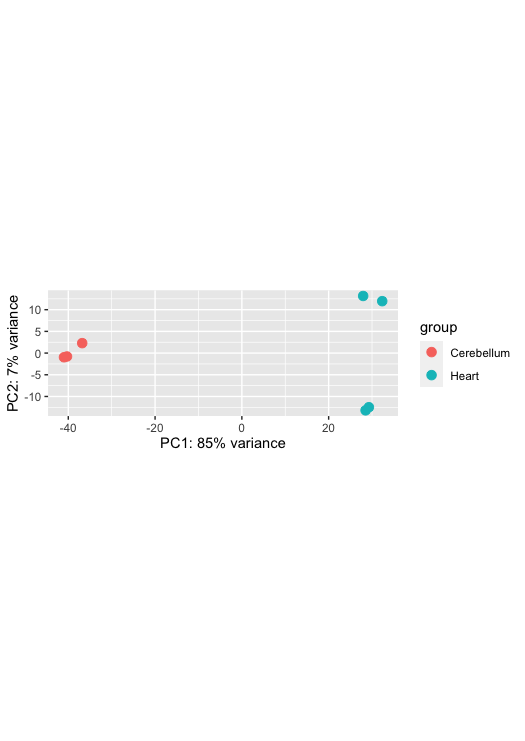
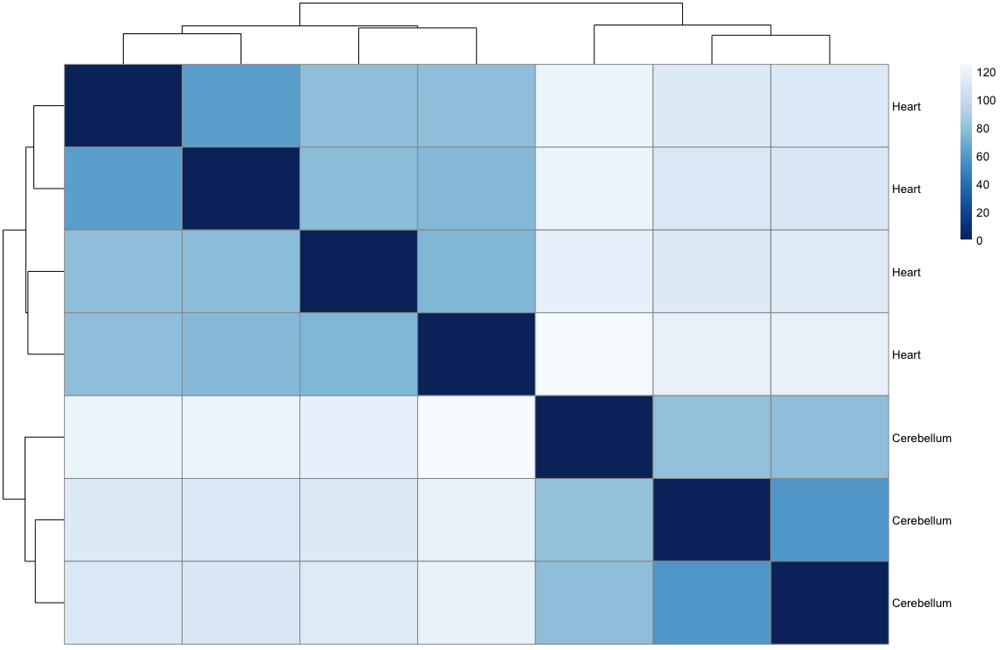
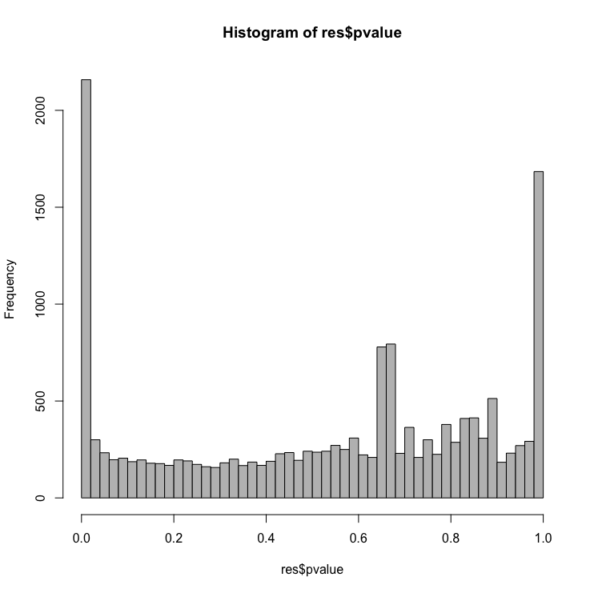

> Overview
> --------
> **Questions**
> 
> *   What are the top DEGs in our experiment? 
>     
> 
> **Objectives**
> 
> *   Use DESeq2 to output top differentially expressed genes  
>  
> *   Understand the best diagrams to show differentially expressed genes
> 

---------------------------------------


The differential expression analysis above operates on the raw (normalized) count data. But for visualizing or clustering data as you would with a microarray experiment, you need to work with transformed versions of the data. First, use a *regularized log* transformation while re-estimating the dispersion ignoring any information you have about the samples (`blind=TRUE`). The point of this is to try to stabilise the variance across all genes. This corrects for sample variability, specifically with lower counts. 

Perform a principal components analysis and hierarchical clustering. PCA is a method to visualise the similarity or dissimilarity between each sample. We would expect the samples to cluster based on tissue. This is because we would expect the cerebellum samples to be more similar to each other than the heart samples. In our MDS plot, we can see SRR306844chr1_chr3 clustering distinctly from all other samples. If not clustering well, it is an indicator of a contaminated sample or confounding factor not taken into account.

Rlog does not use the design to remove variation in the data. It, therefore, does not remove variation that can be associated with batch or other covariates.


```
        # Transform
        rld <- rlog(dds, blind=TRUE)

        #this shows the 
        meanSdPlot(assay(rld))

        # Principal components analysis
        plotPCA(rld, intgroup="source_name")

```





> Exercise
> ---------
> Adapt the ggplot function below to make a prettier PCA
> ```
>        pcaData <- plotPCA(vsd, intgroup=c("source_name"), returnData=TRUE)
>        percentVar <- round(100 * attr(pcaData, "percentVar"))
>        ggplot(pcaData, aes(PC1, PC2, color=condition, shape=type)) +
>          geom_point(size=3) +
>          xlab(paste0("PC1: ",percentVar[1],"% variance")) +
>          ylab(paste0("PC2: ",percentVar[2],"% variance")) + 
>          coord_fixed()
>
> ``` 
> 


## Data Visualization of A Single Gene

Let's look at a single gene across the groups:

```
        plotCounts(dds, gene=which.min(resLFC$padj), intgroup="source_name")
```


> Exercise
> --------
> 
> Can you find a gene of interest within your chromosomes and paper that you would like to plot in a plot like above? Or using ggplot like in the code below (note you will have to adapt this to your paper?
>
```
        d <- plotCounts(dds, gene=which.min(resLFC$padj), intgroup="source_name", 
                        returnData=TRUE)
        ggplot(d, aes(x=condition, y=count)) + 
          geom_point(position=position_jitter(w=0.1,h=0)) + 
          scale_y_log10(breaks=c(25,100,400))
  
```


> Exercise
>
> ```
>        # Hierarchical clustering analysis
>        ## let's get the actual values for the first few genes
>        head(assay(rld))
>        ## now transpose those
>        t(head(assay(rld)))
>        ## now get the sample distances from the transpose of the whole thing
>        dist(t(assay(rld)))
>        sampledist <- dist(t(assay(rld)))
>        plot(hclust(sampledist))
>```


Let's plot a heatmap that also visualised the similarity/dissimilarity across samples.

```
        # ?heatmap for help
        sampledist
        as.matrix(sampledist)
        sampledistmat <- as.matrix(sampledist)
        heatmap(sampledistmat)
```


That's a horribly ugly default. You can change the built-in heatmap function, but others are better. 

```
        sampleDists <- dist(t(assay(rld)))
        sampleDistMatrix <- as.matrix(sampleDists)
        rownames(sampleDistMatrix) <- paste(rld$source_name)
        colnames(sampleDistMatrix) <- NULL
        colors <- colorRampPalette( rev(brewer.pal(9, "Blues")) )(255)
        pheatmap(sampleDistMatrix,
                 clustering_distance_rows=sampleDists,
                 clustering_distance_cols=sampleDists,
                 col=colors)

        select <- order(rowMeans(counts(dds,normalized=TRUE)), decreasing=TRUE)[1:20]
        df <- as.data.frame(colData(dds)[,c("source_name")])
        pheatmap(assay(ntd)[select,], cluster_rows=FALSE, show_rownames=FALSE,
                 cluster_cols=FALSE, annotation_col=df)

```



> Exercise
> ---------
> 
> Can you change values in the colour panel to make the heatmap more colorblind-friendly?
> 


Let's create a histogram of the p-values

```
        # Examine plot of p-values
        hist(resLFC$pvalue, breaks=50, col="grey")
```



>Exercise
>-------
>
>Make a ggplot2 equivalent of the histogram above.
>


## MA plot with annotations!!! Very exciting
Let's plot an MA  plot. This shows the fold change versus the overall expression values. A MA-plot is a scatter plot of log2 fold changes (M, on the y-axis) versus the average expression signal (A, on the x-axis). M = log2(x/y) and A = (log2(x) + log2(y))/2 = log2(xy)*1/2, where x and y are respectively the means of the two groups being compared, cerebellum and heart. 


Let's remake the MA plot but this time 
```
        plotMA(res, ylim=c(-2,2))

```


>Exercise
>-------
>
> What does your MA plot display?
>


Heatmap
-------

```
        dds <- estimateSizeFactors(dds)
        select <- order(rowMeans(counts(dds,normalized=TRUE)),decreasing=TRUE)[1:20]
        df <- as.data.frame(colData(dds)[,c("source_name")])
        colnames(df) <- "Source Name"
        rownames(df) <- rownames(colData(dds))
        
        pheatmap(assay(rld)[select,], cluster_rows=FALSE, show_rownames=FALSE,
                 cluster_cols=FALSE, annotation_col=df)
```


>Exercise
>-------
>
> Can you make this colorblind friendly?
>


Volcano plot
------------

Let's create a volcano plot. The volcano plot shows on shows the -log10pvalue (adjuted) against the logFC. The higher the value of the -log10pval, the greater the confidence in the log FC is not random.

```
par(pch=16)
        res$Gene <- rownames(res)
        with(res, plot(log2FoldChange, -log10(pvalue), main="Volcano plot"))
        with(subset(res, padj<.05 ), points(log2FoldChange, -log10(pvalue), col="red"))
        with(subset(res, abs(log2FoldChange)>2), points(log2FoldChange, -log10(pvalue), col="orange"))
        with(subset(res, padj<.05 & abs(log2FoldChange)>2), points(log2FoldChange, -log10(pvalue), col="green"))

        # Add legend
        legend("topleft", legend=c("FDR<0.05", "|LFC|>2", "both"), pch=16, col=c("red","orange","green"))
        # Label points
        with(subset(res, padj<.05 & abs(log2FoldChange)>2), textxy(log2FoldChange, -log10(pvalue), labs=Gene, cex=1))
```
Every dot represents a gene (not an isoform). This is because we are using the transcriptome as the reference where each transcript name begins with “ENST”, we collapsed those counts from transcripts to gene. An example of a transcript that has a positive log FC due to being highly expressed in the heart, relative to the control cerebellum sample. It codes for a transcript of the gene, ENSG00000163217, [BMP10](http://asia.ensembl.org/Homo_sapiens/Gene/Summary?g=ENSG00000152977;r=3:147393422-147510293) which is a member of the secreted ligand of the TGF-beta (transforming growth factor-beta) superfamily of proteins that is key for embryonic cardiomyocyte proliferation.


> Exercise
> -----------
> This is the ugliest graph ever, can you make it a bit nicer on the eyes?
> 


--------------------------

Beginning section Edited from [Training-modules](https://github.com/hbctraining/Training-modules) 
