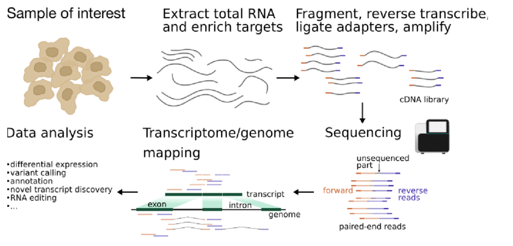
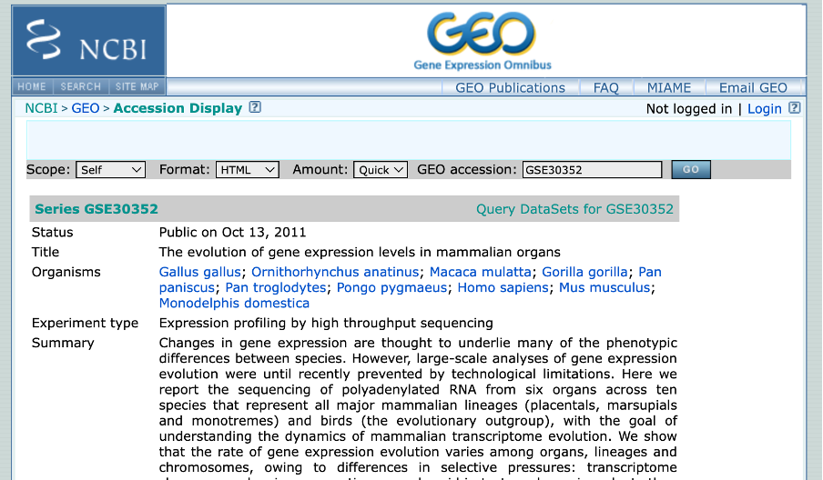
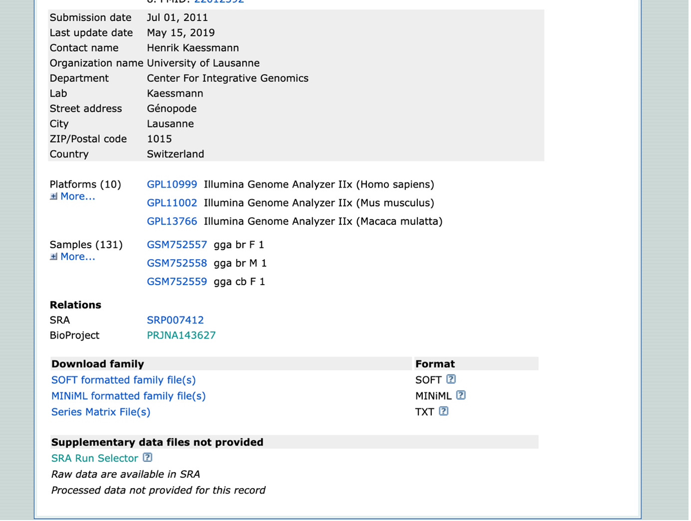
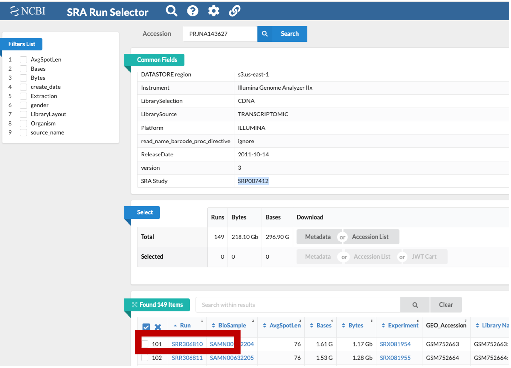
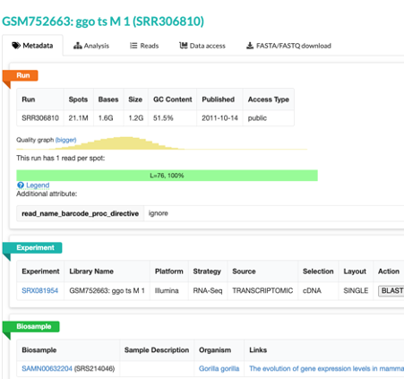
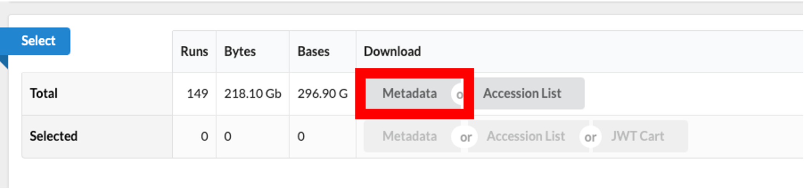

Examining Data on the NCBI SRA Database
=======================================

> Overview
> --------
> 
> 
> **Questions**
> 
> *   How do I access public sequencing data?
>     
> 
> **Objectives**
>
> *   Understand the biological limitations of RNA-seq. 
>
> *   Be aware that public genomic data is available.
>     
> *   Understand how to access and download this data.
>

Publically available data is an amazing resource as:
- to compare your results or annotate your data
- run a different set of analyses on the same data, to answer a different biological question
- prevent recreating labour-intensive wet lab work

When you come to publish a paper including your sequencing data, most journals and funders require that you place your data on a public repository. Sharing your data makes it more likely that your work will be re-used and cited. 

There are many repositories for public data. Some model organisms or fields have specific databases, and there are ones for particular types of data. Two of the most comprehensive public repositories are provided by the [National Center for Biotechnology Information (NCBI)](https://www.ncbi.nlm.nih.gov) and the [European Bioinformatics Institute (EMBL-EBI)](https://www.ebi.ac.uk/). The NCBI’s [Sequence Read Archive (SRA)](https://trace.ncbi.nlm.nih.gov/Traces/sra/) is the database we will be using for this lesson, but the EMBL-EBI’s Nucleotide Archive (ENA) is also useful. The general processes are similar for any database.

An overview of RNA-sequencing data
------------------------------------
In a perfect world, RNA-Seq might work something like this:

1. We know the location of every single gene in the genome (even genes that are identical duplicates of each other).
2. At any given time, we can get an exact readout of how many mRNAs a gene has produced (transcription) and for protein coding mRNA transcripts we know how much protein was yielded.
3. Given 1 and 2, we can clearly tell if gene transcription is different between two different samples (e.g. normal tissue and cancerous).

Unfortunately, here are just some of the ways a real world experiment fails to meet our ideal expectations:

1. We don’t know the location of every gene in the genome (often we think we know most of them though!).
2. Genomes contain gene duplications (identical or near identical copies). Since our DNA sequencing reads are often around 100 nucleotides we may have difficulty telling where a read came from (and thus how to count it).
3. Even if we have an idea of how much RNA is being produced, we don’t know how much of it ends up making a protein.

Overview of the experimental steps in a RNA-seq protocol. The cDNA library is generated from isolated RNA targets, sequenced and the reads are mapped against a reference genome or transcriptome. Downstream data analysis depends on the goal of the experiment and can include, among other things, assessing differential expression, variant calling or genome annotation.

## What is the difference between single and paired-end reads?
With paired-end sequencing, both ends of the fragment are sequenced. With single-end sequencing, only one end of a fragment is sequenced.

Accessing the original archived data
------------------------------------
The [sequencing dataset (from Brawand, _et al._ 2011) adapted for this lesson] was obtained from the [NCBI Sequence Read Archive](https://www.ncbi.nlm.nih.gov/sra), which is a large (~27 petabasepairs/2.7 x 10^16 basepairs as of April 2019) repository for next-generation sequence data. 

Please check your groups, and find your group number by clicking Practical Overview, then Sample Dataset on the class website. **Each student will have a paper that they share with their group but, a distinct subset of chromosomes from the dataset. This will mean everyone’s results will be unique as we run through the practical. **

### Locating the Run Selector Table for the Brawand Dataset on the SRA

Very often there will be a direct link (perhaps in the supplemental information) to where the SRA dataset can be found. If we open the paper and scroll down to sections such as Accession Codes, Data Availability ect. will have a direct link of the accession code for Gene expression omnibus starting with GSE[NUMBER]. 

My paper link is: https://www.nature.com/articles/nature10532#accession-codes

> **Author Information** All sequencing data sets are available under GSE30352. (https://www.ncbi.nlm.nih.gov/geo/query/acc.cgi?acc=GSE30352)

*** For this tutorial, I have provided you all with show you how to access data and metadata. However, for this course, we have already prepared the FASTQ files to make them smaller and less computationally demanding. ***

**You will be given a paper per table**

The paper for your given table can be found on the **Sample Datasets*** tab.

1.	For your chosen paper, you will have to navigate through different aspects of the NCBI website to get to the GEO Accession page. If struggling, please search using the GEO dataset number on (https://www.ncbi.nlm.nih.gov/geo/). It should look akin to the image below.

2.	 Once on the GEO Accession page, scroll down to the BioProject (PJNA[number]). This will provide the dataset in context with the other datasets found within this paper.

3.	 Navigate back to the GEO Accession page. For a more organized table, select “SRA Run Selector”. This takes you to the Run Selector page for your dataset only. 

### Download the Brawand Metadata from the SRA Run Selector Table

1.  This is NCBI’s cloud-based SRA interface. You will be presented with a page for the overall SRA accession 	SRP007412 - this is a collection of all the experimental data.
    
2.  Notice on this page there are three sections. “Common Fields” “Select”, and “Found 149 Items”. Within “Found 149 Items”, click on the first Run Number (Column “Run” Row “1”). 

3.  This will take you to a page that is a run browser. Take a few minutes to examine some of the descriptions on the page. 
   

4.  Use the browser’s back button to go back to the ‘previous page’. As shown in the figure below, the second section of the page (“Select”) has the **Total** row showing you the current number of “Runs”, “Bytes”, and “Bases” in the dataset to date. 

5.  Click on the “Metadata” button to download the data for this lesson. The filename is “SraRunTable.txt” and save it on your computer Desktop. This text-based file is actually a “comma-delimited” file, so you should rename the file to “SraRunTable.csv” for your spreadsheet software to open it correctly.
    

**You should now have a file called `SraRunTable.csv`** on your desktop.

> Now you know that comma-separated (and tab-separated) files can be designated as “text” (`.txt`) files but use either commas (or tabs) as **delimiters**, respectively. Sometimes you might need to use a text-editor (_e.g._ Notepad) to determine if a file suffixed with `.txt` is actually comma-delimited or tab-delimited.

6. For this course we have chosen select samples which have been placed into a smaller version of the SraRunTable.csv. Please download the relevant SraRunTable for your paper from the communal drive. 

### Review the SraRunTable metadata in a spreadsheet program

Using your choice of a spreadsheet program, open the `SraRunTable.csv` file.

> Discussion
> ----------
> 
> Discuss within your groups your dataset
> 
> 1.  What was the experimental control used in this experiment?
> 2.  What was the sequencing platform used for this experiment?
> 3.  Are the samples in the experiment paired-end or single-end sequencing data?
> 4.  What other kind of data is available, that is not included in your given SraRunTable?
> 5. What data is missing from your SraRunTable which would be useful to know?

***Supplementary information***

Downloading sequencing files another method: EMBL-EBI
--------------------------------------------

The SRA does not support direct download of fastq files from its webpage. However, the [European Nucleotide Archive](https://www.ebi.ac.uk/ena/browser/home) does. Let’s see how we can get a download link to a file we are interested in.
We do not recommend downloading large numbers of sequencing files this way. For that, the NCBI has made a software package called the `sra-toolkit`. However, for a couple files, it’s often easier to go through the ENA.

Downloading reference files
-------------------------------------------------
To download the raw human transcriptome data from [Ensembl](http://useast.ensembl.org/). The > wget command will allow us to download the transcriptome from Ensembl. However for downstream analysis, we will use a programme called kallisto which has prebuild indices available from https://github.com/pachterlab/kallisto-transcriptome-indices/releases. 

Where to learn more
-------------------

### About the Sequence Read Archive

*   You can learn more about the SRA by reading the [SRA Documentation](https://www.ncbi.nlm.nih.gov/Traces/sra/)
*   The best way to transfer a large SRA dataset is by using the [SRA Toolkit](https://www.ncbi.nlm.nih.gov/Traces/sra/?view=toolkit_doc)

> Key Points
> ----------
> 
> *   Public data repositories are a great source of genomic data.
>     
> *   You are likely to put your own data on a public repository.
>     

* * *
Adapted from the Data Carpentry Intro to Command Line -shell genomics https://datacarpentry.org/shell-genomics/

Licensed under CC-BY 4.0 2018–2021 by The Carpentries
Licensed under CC-BY 4.0 2016–2018 by Data Carpentry
