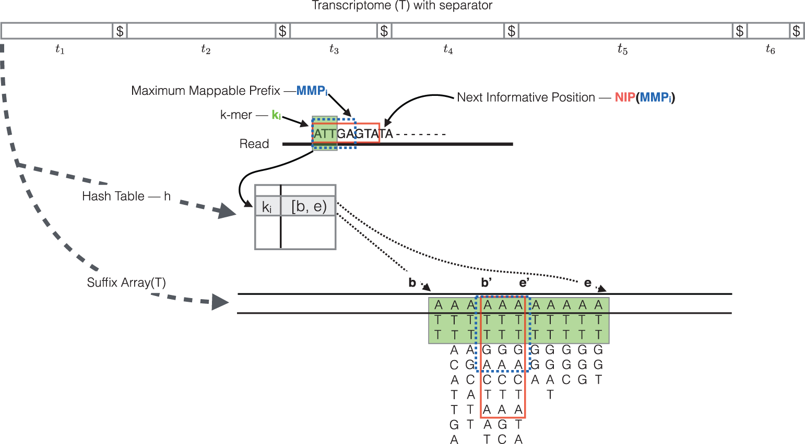

More involved explanation
=========================

#### **Indexing**

This step involves creating an index to evaluate the sequences for all possible unique sequences of length k (kmer) in the **transcriptome** (genes/transcripts).

**The index helps creates a signature for each transcript in our reference transcriptome.** The Kallisto index has two components:

1. a **suffix array** (SA) of the reference transcriptome sequence
2. a **hash table** to map each k-mer occurring in the reference transcriptome to it's location in the SA (is not required, but improves the speed of mapping drastically)

#### **Quasi-mapping and quantification** 

The quasi-mapping approach estimates the numbers of reads mapping to each transcript, and is described below. We have details and a schematic provided by the Rapmap tool [[3](https://academic.oup.com/bioinformatics/article/32/12/i192/2288985/RapMap-a-rapid-sensitive-and-accurate-tool-for)], which provides the underlying algorithm for the quasi-mapping.

- **Step 1: Quasi mapping and abundance estimation**

	
	
	>RapMap: a rapid, sensitive and accurate tool for mapping RNA-seq reads to transcriptomes. A. Srivastava, H. Sarkar, N. Gupta, R. Patro. Bioinformatics (2016) 32 (12): i192-i200.
	
	The quasi-mapping procedure performs the following steps [[3](https://academic.oup.com/bioinformatics/article/32/12/i192/2288985/RapMap-a-rapid-sensitive-and-accurate-tool-for)]:

	1. The read is scanned from left to right until a k-mer that appears in the hash table is discovered.
	2. The k-mer is looked up in the hash table and the SA intervals are retrieved, giving all suffixes containing that k-mer
	3. Similar to STAR, the maximal matching prefix (MMP) is identified by finding the longest read sequence that exactly matches the reference suffixes.
	4. Instead of searching for the next MMP in the read as we do with STAR, Salmon uses a k-mer skipping approach to identify the next informative position (NIP). In this way the SA search is likely to return a different set of transcripts than those returned for the previous MMP. Often natural variation or a sequencing error in the read is the cause of the mismatch from the reference, so beginning the search at this position would likely return the same set of transcripts. 
	5. This process is repeated until the end of the read.
	6. The final set of mappings is determined by a consensus mechanism. Specifically, the algorithm reports the intersection of transcripts appearing in all MMPs for that read. The transcripts, orientation and transcript location are output for each read.
	
>
> **NOTE:** If there are k-mers in the reads that are not in the index, they are not counted. As such, trimming is not required when using this method. Accordingly, if there are reads from transcripts not present in the reference transcriptome, they will not be quantified. Quantification of the reads is only as good as the quality of the reference transcriptome.
	
	
- **Step 2: Improving abundance estimates**
Using multiple complex modeling approaches, like Expectation Maximization (EM), Kallisto can also correct the abundance estimates for any sample-specific biases/factors [[4](http://www.nature.com.ezp-prod1.hul.harvard.edu/nmeth/journal/v14/n4/full/nmeth.4197.html?WT.feed_name=subjects_software&foxtrotcallback=true)]. Generally, this step results in more accurate transcript abundance estimation.

