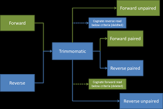

Trimming and Filtering
======================

> Overview
> --------
> **Questions**
> 
> *   How can I get rid of sequence data that does not meet my quality standards?
>     
> 
> **Objectives**
> 
> *   Clean FASTQ reads using Trimmomatic.
>     
> *   Select and set multiple options for command-line bioinformatic tools.
>     
> *   Write `for` loops with two variables.
>     

Cleaning reads
==============

In the previous session, we took a high-level look at the quality of each of our samples using FastQC and multi-qc. We visualized per-base quality graphs showing the distribution of read quality at each base across all reads in a sample and extracted information about which samples fail which quality checks. Some of our samples failed quite a few quality metrics used by FastQC. This does not mean, though, that our samples should be thrown out! It is very common to have some quality metrics fail, and this may or may not be a problem for your downstream application. For our RNA-seq workflow, we will be removing some of the low quality sequences to reduce our false positive rate due to sequencing error.

We will use a program called [Trimmomatic](http://www.usadellab.org/cms/?page=trimmomatic) to filter poor quality reads and trim poor quality bases from our samples.

Trimmomatic options
-------------------

Trimmomatic has a variety of options to trim your reads. If we run the following command, we can see some of our options. (Hint: might need to use ` module load`)

    $ trimmomatic
    

Which will give you the following output:

    Usage: 
           PE [-version] [-threads <threads>] [-phred33|-phred64] [-trimlog <trimLogFile>] [-summary <statsSummaryFile>] [-quiet] [-validatePairs] [-basein <inputBase> | <inputFile1> <inputFile2>] [-baseout <outputBase> | <outputFile1P> <outputFile1U> <outputFile2P> <outputFile2U>] <trimmer1>
       or: 
           SE [-version] [-threads <threads>] [-phred33|-phred64] [-trimlog <trimLogFile>] [-summary <statsSummaryFile>] [-quiet] <inputFile> <outputFile> <trimmer1>
       or: 
           -version
    
First, you need to identify if your sample has paired end (`PE`) or single end (`SE`) reads. Next, we specify what flag we would like to run. For example, you can specify `threads` to indicate the number of processors on your computer that you want Trimmomatic to use. In most cases using multiple threads (processors) can help to run the trimming faster. These flags are not necessary, but they can give you more control over the command. The flags are followed by positional arguments, meaning the order in which you specify them is important. In paired end mode, Trimmomatic expects the two input files, and then the names of the output files. These files are described below. While, in single end mode, Trimmomatic will expect 1 file as input, after which you can enter the optional settings and lastly the name of the output file.

| option         | meaning                                                                                       |
| -------------- | --------------------------------------------------------------------------------------------- |
| `inputFile1`   | Input reads to be trimmed. Typically the file name will contain an `_1` or `_R1` in the name. |
| `inputFile2`   | Input reads to be trimmed. Typically the file name will contain an `_2` or `_R2` in the name. |
| `outputFile1P` | Output file that contains surviving pairs from the `_1` file.                                 |
| `outputFile1U` | Output file that contains orphaned reads from the `_1` file.                                  |
| `outputFile2P` | Output file that contains surviving pairs from the `_2` file.                                 |
| `outputFile2U` | Output file that contains orphaned reads from the `_2` file.                                  |
    
The last thing trimmomatic expects to see is the trimming parameters:

| step            | meaning                                                                                                      |
| --------------- | ------------------------------------------------------------------------------------------------------------ |
| `ILLUMINACLIP`  | Perform adapter removal.                                                                                     |
| `SLIDINGWINDOW` | Perform sliding window trimming, cutting once the average quality within the window falls below a threshold. |
| `LEADING`       | Cut bases off the start of a read, if below a threshold quality.                                             |
| `TRAILING`      | Cut bases off the end of a read, if below a threshold quality.                                               |
| `CROP`          | Cut the read to a specified length.                                                                          |
| `HEADCROP`      | Cut the specified number of bases from the start of the read.                                                |
| `MINLEN`        | Drop an entire read if it is below a specified length.                                                       |
| `TOPHRED33`     | Convert quality scores to Phred-33.                                                                          |
| `TOPHRED64`     | Convert quality scores to Phred-64.                                                                          |

We will use only a few of these options and trimming steps in our analysis. It is important to understand the steps you are using to clean your data. For more information about the Trimmomatic arguments and options, see [the Trimmomatic manual](http://www.usadellab.org/cms/uploads/supplementary/Trimmomatic/TrimmomaticManual_V0.32.pdf).

However, a complete command for Trimmomatic will look something like the command below. This command is an example and will not work, as we do not have the files it refers to:

    $ trimmomatic PE -threads 4 SRR_1056_1.fastq SRR_1056_2.fastq  \
                  SRR_1056_1.trimmed.fastq SRR_1056_1un.trimmed.fastq \
                  SRR_1056_2.trimmed.fastq SRR_1056_2un.trimmed.fastq \
                  ILLUMINACLIP:TruSeq3-PE.fa:2:30:10 LEADING:3 TRAILING:3 SLIDINGWINDOW:4:15 MINLEN:36     
                  
                  
    NB. You will have to edit this command if you have paired end sample. 

In this example, we have told Trimmomatic:

| code                           | meaning                                                                                                   |
| ------------------------------ | --------------------------------------------------------------------------------------------------------- |
| `PE`                           | that it will be taking a paired end file as input                                                         |
| `-threads 4`                   | to use four computing threads to run (this will speed up our run)                                         |
| `SRR_1056_1.fastq`             | the first input file name                                                                                 |
| `SRR_1056_2.fastq`             | the second input file name                                                                                |
| `SRR_1056_1.trimmed.fastq`     | the output file for surviving pairs from the `_1` file                                                    |
| `SRR_1056_1un.trimmed.fastq`   | the output file for orphaned reads from the `_1` file                                                     |
| `SRR_1056_2.trimmed.fastq`     | the output file for surviving pairs from the `_2` file                                                    |
| `SRR_1056_2un.trimmed.fastq`   | the output file for orphaned reads from the `_2` file                                                     |
| `ILLUMINACLIP:SRR_adapters.fa` | to clip the Illumina adapters from the input file using the adapter sequences listed in `SRR_adapters.fa` |
| `SLIDINGWINDOW:4:20`           | to use a sliding window of size 4 that will remove bases if their phred score is below 20                 |
    
    
    
> Multi-line commands
> -------------------
> 
> Some of the commands we ran in this lesson are long! When typing a long command into your terminal, you can use the `\` character to separate code chunks onto separate lines. This can make your code more readable.

Running Trimmomatic
-------------------

Now we will run Trimmomatic on our data. To begin, navigate to the data directory that contains your untrimmed fastq files:

    $ cd /[yourscratch]/data/

We are going to run Trimmomatic on one of my single-end samples. While using FastQC we saw that TruSeq adapters were present in our samples. The adapter sequences came with the installation of trimmomatic, so we will first copy these sequences into our current directory.

    $ scp -r /srv/scratch/babs3291/adapters/ [yourscratch]
    

The adapter sequence you should specify with be dependent on:
1. the platform your samples are run on (check out the GEO website that is relevant to your samples)
2. whether your samples are paired or single end files
3. what adapter sequences are shown to be present in the adapter content graph in your multiqc/fastqc

Please look at the possible adapters that can be used for the adapter sequences 

    $ ls /[yourscratch]/adapters
    
    $ NexteraPE-PE.fa  TruSeq2-PE.fa  TruSeq2-SE.fa  TruSeq3-PE.fa  TruSeq3-PE-2.fa  TruSeq3-SE.fa

If you look at the content inside one of these fasta files. You will realise it is filled with short sequences of oligonucleotides.

    $ head /[yourscratch]/adapters/NexteraPE-PE.fa
    
    $ >PrefixNX/1
    $ AGATGTGTATAAGAGACAG

Use the three steps above to specify one of these files in the subsequent trimming command. 

We will also use a sliding window of size 4 that will remove bases if their phred score is below 20 (like in our example above). We will also discard any reads that do not have at least 25 bases remaining after this trimming step. Three additional pieces of code are also added to the end of the ILLUMINACLIP step. These three additional numbers (2:40:15) tell Trimmimatic how to handle sequence matches to the TruSeq adapters. A detailed explanation of how they work is advanced for this particular lesson. For now we will use these numbers as a default and recognize they are needed to for Trimmomatic to run properly. 

 

This command will take a few minutes to run.

    $ ADAPTERSEQ="[yourscratch]/adapters/TruSeq2-SE.fa"
    $ trimmomatic SE -phred33 SRR306844chr1_chr3.fastq.gz \
                    SRR306844chr1_chr3.trim.fastq.gz \
                    ILLUMINACLIP:${ADAPTERSEQ}:2:30:10 LEADING:3 TRAILING:3 SLIDINGWINDOW:4:15 MINLEN:36 
                        
    TrimmomaticSE: Started with arguments:
    -phred33 SRR306844chr1_chr3.fastq.gz SRR306844chr1_chr3.trim.fastq.gz ILLUMINACLIP:/srv/scratch/z5342988/adapters/TruSeq2-SE.fa:2:30:10 LEADING:3 TRAILING:3 SLIDINGWINDOW:4:15 MINLEN:36
    Automatically using 4 threads
    Using Long Clipping Sequence: 'AGATCGGAAGAGCGGTTCAGCAGGAATGCCGAG'
    Using Long Clipping Sequence: 'AGATCGGAAGAGCGTCGTGTAGGGAAAGAGTGT'
    Using Long Clipping Sequence: 'AGATCGGAAGAGCTCGTATGCCGTCTTCTGCTTG'
    ILLUMINACLIP: Using 0 prefix pairs, 3 forward/reverse sequences, 0 forward only sequences, 0 reverse only sequences
    Input Reads: 5416173 Surviving: 5165820 (95.38%) Dropped: 250353 (4.62%)
    TrimmomaticSE: Completed successfully
    
 

 A way of thinking about the files you are using 
 If you have paired end sequences you should run the command from before. 
 
     $ trimmomatic PE -threads 4 SRR_1056_1.fastq.gz SRR_1056_2.fastq.gz  \
                  SRR_1056_1.trimmed.fastq.gz SRR_1056_1un.trimmed.fastq.gz \
                  SRR_1056_2.trimmed.fastq.gz SRR_1056_2un.trimmed.fastq.gz \
                  ILLUMINACLIP:TruSeq3-PE.fa:2:30:10 LEADING:3 TRAILING:3 SLIDINGWINDOW:4:15 MINLEN:36     
                  
    
    
> Exercise
> --------
> 
> Use the output from your Trimmomatic command to answer the following questions.
> 
> 1) What percent of reads did you discard from your sample? 
> 2) What percent of reads did we keep both pairs?
> 3) What biological samples are more likely to have a higher percentage trimming? 

    
    
You may have noticed that Trimmomatic automatically detected the quality encoding of our sample. It is always a good idea to double-check this or to enter the quality encoding manually.

We can confirm that we have our output files:

    $ ls SRR306844*
    

The output files are also FASTQ files. It should be smaller than our input file, because we have removed reads. We can confirm this:

    $ ls -lh SRR306844*

    -rw-------. 1 z5342988 unsw 360M Feb 19 09:29 SRR306844chr1_chr3.trim.fastq.gz
    -rw-------. 1 z5342988 unsw 392M Feb 19 09:07 SRR306844chr1_chr3.fastq.gz

We have just successfully run Trimmomatic on one of our FASTQ files! However, there is some bad news. Trimmomatic can only operate on one sample at a time and we have more than one sample. The good news is that we can use a `for` loop to iterate through our sample files quickly!
    
 

    $ for infile in *.fastq.gz
    > do
    >   base=$(basename ${infile} .fastq.gz)
    >   outfile="${base}.trimmed.fastq.gz"
    >       trimmomatic SE -phred33 ${infile} \
    >                ${outfile} \
    >                ILLUMINACLIP:${ADAPTERSEQ}:2:30:10 LEADING:3 TRAILING:3 SLIDINGWINDOW:4:15 MINLEN:36 
    > done

This is too computationally demanding to perform without requesting resources from the HPC. 
Please either a) run interactively b) submit to the hpc

If you have a paired end sequence the for loop with be different...

    $ for infile in *_1.fastq.gz
    > do
    >   base=$(basename ${infile} _1.fastq.gz)
    >   infile_2="${base}_2.fastq.gz"
    >   trimmed_1="${base}_1.trimmed.fastq.gz"
    >   trimmed_2="${base}_2.trimmed.fastq.gz"
    >   untrimmed_1="${base}_1.untrimmed.fastq.gz"
    >   untrimmed_2="${base}_2.untrimmed.fastq.gz
    >   trimmomatic PE -phred33 -threads 4 ${infile} ${infile_2} \
                  ${trimmed_1} ${untrimmed_1} \
                  ${trimmed_2} ${untrimmed_2} \
                  ILLUMINACLIP:TruSeq3-PE.fa:2:30:10 LEADING:3 TRAILING:3 SLIDINGWINDOW:4:15 MINLEN:36  
    > done

    
> Exercise
> --------
> 
> 1) We trimmed our fastq files with Nextera adapters, but there are other adapters that are commonly used. What other adapter files came with Trimmomatic?
> 2) What is the purpose of adapter sequences?
>
    

We have now completed the trimming and filtering steps of our quality control process! Before we move on, let’s move our trimmed FASTQ files to a new subdirectory within our `data` directory.

    $ cd /srv/scratch/z5342988/data/
    $ mkdir TRIMMED_FASTQ
    $ mv ./UNTRIMMED_FASTQ/*.trim* TRIMMED_FASTQ
    $ ls
    

> Bonus exercise (advanced)
> -------------------------
> 
> Now that our samples have gone through quality control, they should perform better on the quality tests run by FastQC. Go ahead and re-run FastQC on your trimmed FASTQ files and visualize the HTML files to see whether your per base sequence quality is higher after trimming.
> 
> Key Points
> ----------
> 
> *   The options you set for the command-line tools you use are important!
>     
> *   Data cleaning is an essential step in a genomics workflow.
>

* * *

Adapted from the Data Carpentry Intro to Command Line -shell genomics https://datacarpentry.org/shell-genomics/

Licensed under CC-BY 4.0 2018–2022 by [The Carpentries](https://carpentries.org/)  
Licensed under CC-BY 4.0 2016–2018 by [Data Carpentry](http://datacarpentry.org)
