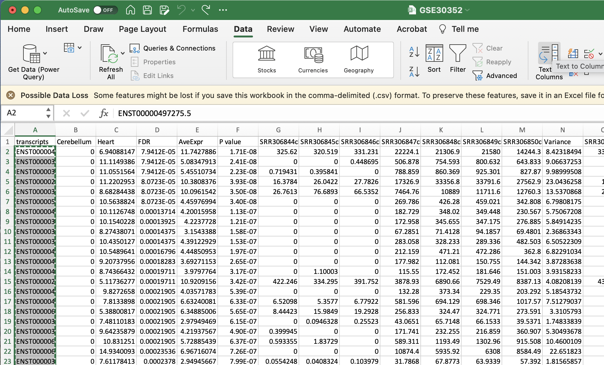

Week 9 - Differential gene expression (DGE) analysis
====================================================

> Overview
> --------
> **Questions**
> 
> *   What are the top DEGs in our experiment? 
>     
> 
> **Objectives**
> 
> *   Use DEGUST to output top differentially expressed genes  
>  
> *   Understand the best diagrams to show differentially expressed genes
> 

---------------------------------------

The next step in the RNA-seq workflow is the differential expression analysis. Differential expression testing aims to determine which genes are expressed at different levels between conditions. These genes can offer biological insight into the processes affected by the condition(s) of interest.

The steps outlined in the gray box below we have already discussed, and we will now continue to describe the steps in an **end-to-end gene-level RNA-seq differential expression workflow**.


So what does the count data actually represent? The count data used for differential expression analysis represents the number of sequence reads that originated from a particular gene. The higher the number of counts, the more reads associated with that gene, and the assumption that there was a higher gene expression level in the sample.


***Note: We are using features that are transcripts, not genes***
Usually, you would sum all the transcript expression for a given gene. This would change a transcript x count matrix to form a gene x count matrix. To make the pipeline simple- we will not be doing this. 


Counts and CPM
---------------
Kallisto counts the number of reads that align to one transcript. This is the *raw count*; however, normalisation is needed to make accurate comparisons of gene expression between samples. Normalisation is used to account for variabilities between or within *raw counts* due to technical differences such as read depth. The default in DEGUST is *Counts per million (CPM)*. CPM accounts for sequencing depth. This is not the best normalisation method for differential expression analysis between samples. However, we are not going to learn R in this course, so we have to work with what we have. 

Using DESeq
-------------

1. Preparing data to be compatible for use in DESeq
2. Transferring locally
3. Reformatting metadata and uploading counts table  to DESeq 
4. Understanding the output 
5. Gene ontology output
6. Taking into account confounding effects **(Extra found in tutorial)**


Preparing DESeq Compatible Data
--------------------------------

Log onto the Wolfpack. Change the directory into the location that contains your aligned kallisto output `abundance.tsv`.

        $ ssh [userid]@dice02.garvan.unsw.edu.au
        $ cd /srv/scratch/zID/data/SRR306844chr1_chr3/
        $ ls abundance.tsv
      
This file contains the counts of one sample. For input into DESeq, you will have to form a count matrix table.  

Please download this [script](https://github.com/theheking/babs-rna-seq/blob/gh-pages/metadatafiles/merge_abundance_files.sh) using `wget`. In the main folder that you have your kallisto results.

        $ cd /srv/scratch/zID/data/
        $ wget https://github.com/theheking/intro-to-rnaseq/raw/gh-pages/metadatafiles/merge_abundance_files.sh 
        $ bash merge_abundance_files.sh
        This scripts is to concatenate all abundance tsv to form count matrix table
        ***Please be in the main directory which contains /samplename/abundance.tsv***
        
 This should output one file called `transcript_counts.csv`. Please check that it is:
 1) comma separated using `head -n 3`
 2) the number of samples should equal the number of columns + 1
 3) has the 205541 lines using `wc -l`
    
  
This `transcript_counts.csv` is the file you will transfer to your local computer. 

Transferring to local computer
------------------------------

You will now be transferring your file to your local computer. First move into a directory that you can access. 
   
    $ scp [userID]@dice02.garvan.unsw.edu.au:"/srv/scratch/zID/data/transcript_counts.csv" .
    

Uploading metadata and counts table to DESeq 
-----------------------------------------------


Analyzing an RNAseq experiment begins with sequencing reads. These are aligned to a reference genome, then the number of reads mapped to each gene can be counted.

The data for this tutorial comes from a PLOS ONE paper, [Genome-Wide Transcriptional Profiling of Skin and Dorsal Root Ganglia after Ultraviolet-B-Induced Inflammation](http://www.plosone.org/article/info%3Adoi%2F10.1371%2Fjournal.pone.0093338), and the raw data can be downloaded from [Gene Expression Omnibus database (GEO)](http://www.ncbi.nlm.nih.gov/geo/query/acc.cgi?acc=GSE54413).

This data has already been downloaded and aligned to the human genome. The command line tool [featureCounts](http://bioinf.wehi.edu.au/featureCounts/) was used to count reads mapped to human genes from the [Ensembl annotation](http://www.ensembl.org/info/data/ftp/index.html).

The output from this tool is provided in the `counts.txt` file in the `data` directory. Have a look at this file in the shell, using `head`.

First, set your working directory to the top level of the RNA-seq course. Import the data into R as a `data.frame` and examine it again. You can set the arguments of `read.table` to import the first row as a header giving the column names, and the first column as row names.

```{r data_input}
# Filename with output from featureCounts
countfile <- "data/counts.txt"
# Read in the data
countdata <- read.table(countfile, header=TRUE, row.names=1)
head(countdata)
colnames(countdata)
class(countdata)
```

The data.frame contains information about genes (one gene per row) with the gene positions in the first five columns and then information about the number of reads aligning to the gene in each experimental sample. There are three replicates for control (column names starting with "ctl") and three for samples treated with ultraviolet-B light (starting "uvb"). We don't need the information on gene position for this analysis, just the counts for each gene and sample, so we can remove it from the data frame.

```{r remove_metadata_cols}
# Remove first five columns (chr, start, end, strand, length)
countdata <- countdata[ ,-(1:5)]
head(countdata)
colnames(countdata)
```

We can rename the columns to something shorter and a bit more readable.

```{r bad_renaming, eval=FALSE}
# Manually
c("ctl1", "ctl2", "ctl3", "uvb1", "uvb2", "uvb3")
```

We can do it manually, but what if we have 600 samples instead of 6? This would become cumbersome. Also, it's always a bad idea to hard-code sample phenotype information at the top of the file like this. A better way to do this is to use the `gsub` command to strip out the extra information. This more robust to introduced errors, for example if the column order changes at some point in the future or you add additional replicates.

```{r rename_cols}
# Using gsub -- robust. Get help with ?gsub
gsub(pattern="trimmed_|.fastq_tophat.accepted_hits.bam", replacement="", x=colnames(countdata))
colnames(countdata) <- gsub(pattern="trimmed_|.fastq_tophat.accepted_hits.bam", replacement="", x=colnames(countdata))
head(countdata)
```

---

**EXERCISE**

There's an R function called `rowSums()` that calculates the sum of each row in a numeric matrix, like the count matrix we have here, and it returns a vector. There's also a function called `which.max()` that determines the index of the maximum value in a vector.

0. Find the gene with the highest expression across all samples -- remember, each row is a gene.
0. Extract the expression data for this gene for all samples.
0. In which sample does it have the highest expression?
0. What is the function of the gene? Can you suggest why this is the top expressed gene?

```{r, echo=FALSE, include=FALSE}
topGene <- which.max(rowSums(countdata))
topGene
countdata[topGene, ]
# this is a pseudogene - maybe an artefact of only aligning reads to a single chromosome?
```

## Install and load packages

First, we'll need to install some add-on packages. Most generic R packages are hosted on the Comprehensive R Archive Network (CRAN, <http://cran.us.r-project.org/>). To install one of these packages, you would use `install.packages("packagename")`. You only need to install a package once, then load it each time using `library(packagename)`. Let's install the **gplots** and **calibrate** packages.

```{r install_packages, eval=FALSE}
install.packages("gplots")
install.packages("calibrate")
```

Bioconductor packages work a bit differently, and are not hosted on CRAN. Go to <http://bioconductor.org/> to learn more about the Bioconductor project. To use any Bioconductor package, you'll need a few "core" Bioconductor packages. Run the following commands to (1) download the installer script, and (2) install some core Bioconductor packages. You'll need internet connectivity to do this, and it'll take a few minutes, but it only needs to be done once.

```{r bioclite, eval=FALSE}
# Download the installer script
source("http://bioconductor.org/biocLite.R")

# biocLite() is the bioconductor installer function. Run it without any
# arguments to install the core packages or update any installed packages. This
# requires internet connectivity and will take some time!
biocLite()
```

To install specific packages, first download the installer script if you haven't done so, and use `biocLite("packagename")`. This only needs to be done once then you can load the package like any other package. Let's download the [DESeq2 package](http://www.bioconductor.org/packages/release/bioc/html/DESeq2.html):

```{r load_deseq2, eval=FALSE}
# Do only once
source("http://bioconductor.org/biocLite.R")
biocLite("DESeq2")
```

Now let's load the packages we'll use:

```{r load_pkgs, eval=TRUE}
library(DESeq2)
library(gplots)
library(calibrate)
```

## DESeq2 analysis

DESeq2 is an R package for analyzing count-based NGS data like RNA-seq. It is available from [Bioconductor](http://www.bioconductor.org/). Bioconductor is a project to provide tools for analysing high-throughput genomic data including RNA-seq, ChIP-seq and arrays. You can explore Bioconductor packages [here](http://www.bioconductor.org/packages/release/BiocViews.html#___Software).

Just like R packages from CRAN, you only need to install Bioconductor packages once, then load them every time you start a new R session.

```{r install_deseq2, eval=FALSE}
source("http://bioconductor.org/biocLite.R")
biocLite("DESeq2")
```

```{r load_deseq22}
library("DESeq2")
citation("DESeq2")
```

It requires the count data to be in matrix form, and an additional dataframe describing sample metadata. Notice that the **colnames of the countdata** match the **rownames of the metadata*.

```{r read_coldata}
mycoldata <- read.csv("data/coldata.csv", row.names=1)
mycoldata
```

DESeq works on a particular type of object called a DESeqDataSet. The DESeqDataSet is a single object that contains input values, intermediate calculations like how things are normalized, and all results of a differential expression analysis. You can construct a DESeqDataSet from a count matrix, a metadata file, and a formula indicating the design of the experiment.

```{r make_deseqdataset}
dds <- DESeqDataSetFromMatrix(countData=countdata, colData=mycoldata, design=~condition)
dds
```

Next, let's run the DESeq pipeline on the dataset, and reassign the resulting object back to the same variable. Before we start, `dds` is a bare-bones DESeqDataSet. The `DESeq()` function takes a DESeqDataSet and returns a DESeqDataSet, but with lots of other information filled in (normalization, results, etc). Here, we're running the DESeq pipeline on the `dds` object, and reassigning the whole thing back to `dds`, which will now be a DESeqDataSet populated with results.

```{r run_deseq}
dds <- DESeq(dds)
```

Now, let's use the `results()` function to pull out the results from the `dds` object. Let's re-order by the adjusted p-value.

```{r}
# Get differential expression results
res <- results(dds)
head(res)

# Order by adjusted p-value
res <- res[order(res$padj), ]
head(res)
```

Combine DEseq results with the original counts data. Write significant results to a file.

```{r write_results}
sig <- subset(res, padj<0.05)
dir.create("results")
write.csv(sig, file="results/sig.csv") # tab delim data
```

You can open this file in Excel or any text editor (try it now).

## Data Visualization

We can also do some exploratory plotting of the data.

The differential expression analysis above operates on the raw (normalized) count data. But for visualizing or clustering data as you would with a microarray experiment, you ned to work with transformed versions of the data. First, use a *regularlized log* transofmration while re-estimating the dispersion ignoring any information you have about the samples (`blind=TRUE`). Perform a principal components analysis and hierarchical clustering.

```{r}
# Transform
rld <- rlogTransformation(dds)

# Principal components analysis
plotPCA(rld, intgroup="condition")

# Hierarchical clustering analysis
## let's get the actual values for the first few genes
head(assay(rld))
## now transpose those
t(head(assay(rld)))
## now get the sample distances from the transpose of the whole thing
dist(t(assay(rld)))
sampledist <- dist(t(assay(rld)))
plot(hclust(sampledist))
```

Let's plot a heatmap.

```{r plot_heatmaps}
# ?heatmap for help
sampledist
as.matrix(sampledist)
sampledistmat <- as.matrix(sampledist)
heatmap(sampledistmat)
```

That's a horribly ugly default. You can change the built-in heatmap function, but others are better.

```{r gplots_heatmap}
# better heatmap with gplots
library("gplots")
heatmap.2(sampledistmat)
heatmap.2(sampledistmat, key=FALSE, trace="none")
colorpanel(10, "black", "white")
heatmap.2(sampledistmat, col=colorpanel(64, "black", "white"), key=FALSE, trace="none")
heatmap.2(sampledistmat, col=colorpanel(64, "steelblue", "white"), key=FALSE, trace="none")
heatmap.2(sampledistmat, col=colorpanel(64, "red", "white", "blue"), key=FALSE, trace="none")
```

What about a histogram of the p-values?

```{r plot_pval_hist}
# Examine plot of p-values
hist(res$pvalue, breaks=50, col="grey")
```

Let's plot an MA-plot. This shows the fold change versus the overall expression values.

```{r MA_plot}
with(res, plot(baseMean, log2FoldChange, pch=16, cex=.5, log="x"))
with(subset(res, padj<.05), points(baseMean, log2FoldChange, col="red", pch=16))

# optional: label the points with the calibrate package. see ?textxy for help
library("calibrate")
res$Gene <- rownames(res)
head(res)
with(subset(res, padj<.05), textxy(baseMean, log2FoldChange, labs=Gene, cex=1, col="red"))
```

Let's create a volcano plot.

```{r volcano_plot}
par(pch=16)
with(res, plot(log2FoldChange, -log10(pvalue), main="Volcano plot"))
with(subset(res, padj<.05 ), points(log2FoldChange, -log10(pvalue), col="red"))
with(subset(res, abs(log2FoldChange)>2), points(log2FoldChange, -log10(pvalue), col="orange"))
with(subset(res, padj<.05 & abs(log2FoldChange)>2), points(log2FoldChange, -log10(pvalue), col="green"))
# Add legend
legend("topleft", legend=c("FDR<0.05", "|LFC|>2", "both"), pch=16, col=c("red","orange","green"))
# Label points
with(subset(res, padj<.05 & abs(log2FoldChange)>2), textxy(log2FoldChange, -log10(pvalue), labs=Gene, cex=1))
```

## Record package and version info with `sessionInfo()`

The `sessionInfo()` prints version information about R and any attached packages. It's a good practice to always run this command at the end of your R session and record it for the sake of reproducibility in the future.

```{r, results='markup'}
sessionInfo()
```


## Going further

* After the course, download the [Integrative Genome Viewer](http://www.broadinstitute.org/igv/) from the Broad Institute. Download all your .bam files from your AWS instance, and load them into IGV. Try navigating to regions around differentially expressed genes to view how reads map to genes differently in the controls versus the irradiated samples.
* Can you see any genes where differential expression is likely attributable to a specific isoform?
* Do you see any instances of differential exon usage? You can investigate this formally with the [DEXSeq](http://www.bioconductor.org/packages/release/bioc/html/DEXSeq.html) package.
* Read about pathway analysis with [GOSeq](http://www.bioconductor.org/packages/release/bioc/html/goseq.html) or [SeqGSEA](http://www.bioconductor.org/packages/release/bioc/html/SeqGSEA.html) - tools for gene ontology analysis and gene set enrichment analysis using next-generation sequencing data.
* Read about multifactor designs in the [DESeq2 vignette](http://www.bioconductor.org/packages/release/bioc/vignettes/DESeq2/inst/doc/DESeq2.pdf) for cases where you have multiple variables of interest (e.g. irradiated vs controls in multiple tissue types).


  


Exploring Gene Ontology Analysis
-----------------------------------
Gene ontology is a tool used to understand the molecular function, biological process and cellular components of the genes that are differentially expressed across conditions. 

1. Create a list of transcript IDs. 
After selecting download csv, you should open your csv in either Google Sheets or Microsoft Excel. 

Please remove the final decimal points from every transcriptID by selecting Data to Columns and using "." as the delimiter. I will show you how remove the decimal points in Excel as that is my system default. 
1. Select Text to Columns
2. Select delimited 
3. Select other and enter in a fulls-stop (.) 
4. Select finish
5. Ignore the alert 
6. Copy the list of transcripts that now should be formatted to from a list of transcript IDs such as ENST00000497275.5 to ENST00000497275. 

2. Convert transcript IDs to GeneIDs using [GO Convert Website](https://biit.cs.ut.ee/gprofiler/convert).
Copy and paste the transcript IDs to the gene conversion. This will output genes that match isoforms of interest.

Select ENSG as the Target Namespace

Click the little clipboard logo next to `converted alias`. This will copy all the gene names to your clipboard. 

3. Find gene ontology profile using [GO ontology profile](https://biit.cs.ut.ee/gprofiler/gost).


Paste this list of geneIDs as input into gene ontology enrichment website and select run query. 
The top most enriched GO terms will be displayed in an assortment of figures. For example, one of the top enriched processes is circulatory system development, which is unsuprising as we are looking at genes that are DE in heart samples vs cerebellum. 


Note the choice of background set is key for getting accurate results. This is because frequency of genes annotated to a GO term is relative to the entire background set. [Gene Ontology Website](http://geneontology.org/docs/go-enrichment-analysis/) explains this articulately:
**"For example, if the input list contains 10 genes and the enrichment is done for biological process in S. cerevisiae whose background set contains 6442 genes, then if 5 out of the 10 input genes are annotated to the GO term: DNA repair, then the sample frequency for DNA repair will be 5/10. Whereas if there are 100 genes annotated to DNA repair in all of the S. cerevisiae genome, then the background frequency will be 100/6442." **


Please explore all of the different figures. Depending on your samples and your biological question the results could be interesting or not... 


Beginning section Edited from [Training-modules](https://github.com/hbctraining/Training-modules) 
