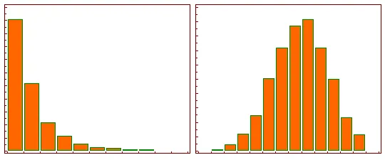

 Week 9B - Theory of Differential gene expression (DGE) analysis
================================================================

> Overview
> --------
> **Questions**
> 
> *   What calculations are actually being performed with DE?
>     
> 
> **Objectives**
> 
> *   Understanding how DEGUST is calculating the top differentially expressed genes  
>  
> 

---------------------------------------

**The differential expression analysis steps are shown in the flowchart below in green**. 

**These are automatically calculated by inputing our gene count matrix into DEGUST**

1. First, the count data needs to be normalized to account for differences in library sizes and RNA composition between samples. 

2. Then, we will use the normalized counts to make some plots for QC at the gene and sample level. 

3. Finally, the differential expression analysis is performed using your tool of interest.

Normalization
-------------

The first step in the DE analysis workflow is count normalization, which is necessary to make accurate comparisons of gene expression between samples.

The counts of mapped reads for each gene is proportional to the expression of RNA (“interesting”) in addition to many other factors (“uninteresting”). Normalization is the process of scaling raw count values to account for the “uninteresting” factors. In this way the expression levels are more comparable between and within samples.

The main factors often considered during normalization are:

*   **Sequencing depth:** Accounting for sequencing depth is necessary for comparison of gene expression between samples. In the example below, each gene appears to have doubled in expression in _Sample A_ relative to _Sample B_, however this is a consequence of _Sample A_ having double the sequencing depth.
    
    
    
    > _**NOTE:** In the figure above, each pink and green rectangle represents a read aligned to a gene. Reads connected by dashed lines connect a read spanning an intron._
    
*   **Gene length:** Accounting for gene length is necessary for comparing expression between different genes within the same sample. In the example, _Gene X_ and _Gene Y_ have similar levels of expression, but the number of reads mapped to _Gene X_ would be many more than the number mapped to _Gene Y_ because _Gene X_ is longer.
    
    
    
*   **RNA composition:** A few highly differentially expressed genes between samples, differences in the number of genes expressed between samples, or presence of contamination can skew some types of normalization methods. Accounting for RNA composition is recommended for accurate comparison of expression between samples, and is particularly important when performing differential expression analyses \[[1](https://genomebiology.biomedcentral.com/articles/10.1186/gb-2010-11-10-r106)\].
    
    In the example, if we were to divide each sample by the total number of counts to normalize, the counts would be greatly skewed by the DE gene, which takes up most of the counts for _Sample A_, but not _Sample B_. Most other genes for _Sample A_ would be divided by the larger number of total counts and appear to be less expressed than those same genes in _Sample B_.
    
    
    

**_While normalization is essential for differential expression analyses, it is also necessary for exploratory data analysis, visualization of data, and whenever you are exploring or comparing counts between or within samples._**

### Common normalization methods

For DEGUST, we had to use CPM. This is not a good method for between sample comparisons. Manual analysis with R programming is superior to using DEGUST, however takes more time and experience to get to grips with!  

Several common normalization methods exist to account for these differences:

| Normalization method                                                                                                          | Description                                                                                                                  | Accounted factors                    | Recommendations for use                                                                                                 |
| ----------------------------------------------------------------------------------------------------------------------------- | ---------------------------------------------------------------------------------------------------------------------------- | ------------------------------------ | ----------------------------------------------------------------------------------------------------------------------- |
| **CPM** (counts per million)                                                                                                  | counts scaled by total number of reads                                                                                       | sequencing depth                     | gene count comparisons between replicates of the same samplegroup; **NOT for within sample comparisons or DE analysis** |
| **TPM** (transcripts per kilobase million)                                                                                    | counts per length of transcript (kb) per million reads mapped                                                                | sequencing depth and gene length     | gene count comparisons within a sample or between samples of the same sample group; **NOT for DE analysis**             |
| **RPKM/FPKM** (reads/fragments per kilobase of exon per million reads/fragments mapped)                                       | similar to TPM                                                                                                               | sequencing depth and gene length     | gene count comparisons between genes within a sample; **NOT for between sample comparisons or DE analysis**             |
| DESeq2’s **median of ratios** \[[1](https://genomebiology.biomedcentral.com/articles/10.1186/gb-2010-11-10-r106)\]            | counts divided by sample-specific size factors determined by median ratio of gene counts relative to geometric mean per gene | sequencing depth and RNA composition | gene count comparisons between samples and for **DE analysis**; **NOT for within sample comparisons**                   |
| EdgeR’s **trimmed mean of M values (TMM)** \[[2](https://genomebiology.biomedcentral.com/articles/10.1186/gb-2010-11-3-r25)\] | uses a weighted trimmed mean of the log expression ratios between samples                                                    | sequencing depth, RNA composition    | gene count comparisons between samples and for **DE analysis**; **NOT for within sample comparisons**                   |

### RPKM/FPKM (not recommended for between sample comparisons)

While TPM and RPKM/FPKM normalization methods both account for sequencing depth and gene length, RPKM/FPKM are not recommended. **The reason is that the normalized count values output by the RPKM/FPKM method are not comparable between samples.**

Using RPKM/FPKM normalization, the total number of RPKM/FPKM normalized counts for each sample will be different. Therefore, you cannot compare the normalized counts for each gene equally between samples.

**RPKM-normalized counts table**

| gene                         | sampleA   | sampleB   |
| ---------------------------- | --------- | --------- |
| XCR1                         | 5.5       | 5.5       |
| WASHC1                       | 73.4      | 21.8      |
| …                            | …         | …         |
| Total RPKM-normalized counts | 1,000,000 | 1,500,000 |

For example, in the table above, SampleA has a greater proportion of counts associated with XCR1 (5.5/1,000,000) than does sampleB (5.5/1,500,000) even though the RPKM count values are the same. Therefore, we cannot directly compare the counts for XCR1 (or any other gene) between sampleA and sampleB because the total number of normalized counts are different between samples.

> _NOTE:_ [This video by StatQuest](http://www.rna-seqblog.com/rpkm-fpkm-and-tpm-clearly-explained/) shows in more detail why TPM should be used in place of RPKM/FPKM if needing to normalize for sequencing depth and gene length.

***Why do we use log for normalisation?***

Log normalisation reduces or removes skewness from counts data and forms a normal distribution which is needed to utilise statistical tests later in the analysis.

**Taken from [kyawsawhtoon](https://medium.com/@kyawsawhtoon/log-transformation-purpose-and-interpretation-9444b4b049c9)**

Quality Control
===============

The next step in the differential expression workflow is QC, which includes sample-level and gene-level steps to perform QC checks on the count data to help us ensure that the samples/replicates look good.

Sample-level QC
---------------

A useful initial step in an RNA-seq analysis is often to assess overall similarity between samples:

*   Which samples are similar to each other, which are different?
*   Does this fit to the expectation from the experiment’s design?
*   What are the major sources of variation in the dataset?

Log2-transformed normalized counts are used to assess similarity between samples using the most common of which is Principal Component Analysis (PCA) and hierarchical clustering. PCA is analogous to the multidimension scaling used in DEGUST. Using log2 transformation, tools aim to moderate the variance across the mean, thereby improving the distances/clustering for these visualization methods.

Sample-level QC allows us to see how well our replicates cluster together, as well as, observe whether our experimental condition represents the major source of variation in the data. Performing sample-level QC can also identify any sample outliers, which may need to be explored to determine whether they need to be removed prior to DE analysis.

Gene-level QC
-------------

In addition to examining how well the samples/replicates cluster together, there are a few more QC steps. Prior to differential expression analysis it is beneficial to omit genes that have little or no chance of being detected as differentially expressed. This will increase the power to detect differentially expressed genes. The genes omitted fall into three categories:

*   Genes with zero counts in all samples
*   Genes with an extreme count outlier
*   Genes with a low mean normalized counts

Filtering is a necessary step, even if you are using limma-voom. 

____
This has been adapted from [Training-modules](https://github.com/hbctraining/Training-modules) 
