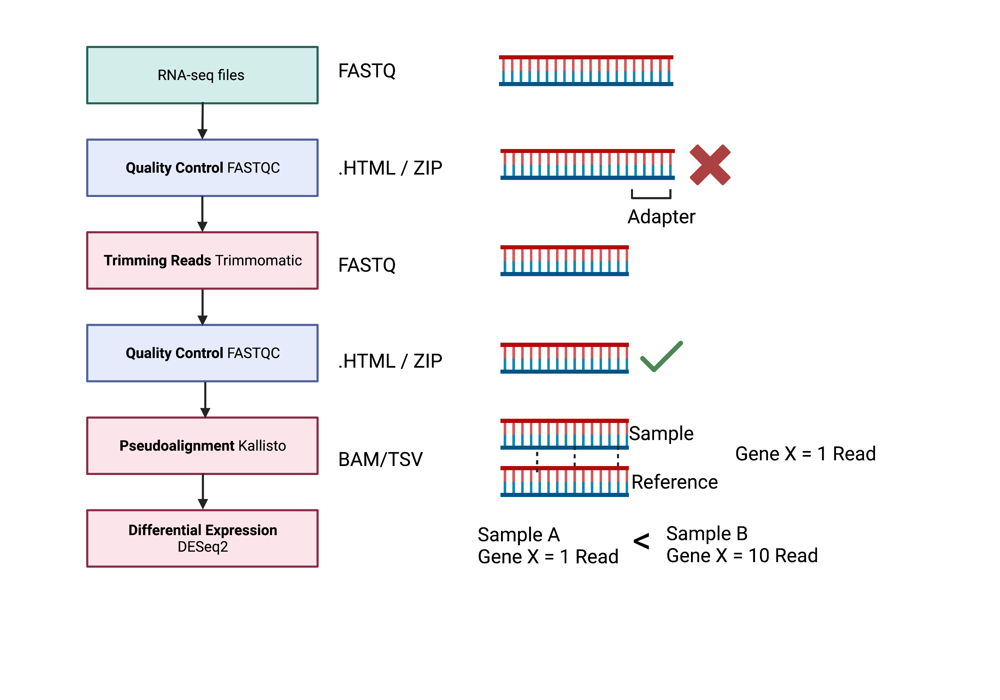

Week 4 - Practical
=====================

The structure of today's session is to:

1. To run through our technical understanding of trimmomatic from yesterday's practical. 
2. Run through for loops 
3. Understanding what has been trimmed or removed from your original fastq files. 
4. Run through any Q and A for your talks 
- *** If you are having issues please bring up any errors. If we don't know the answer we can work it out. ***

 

 

Some Time Saving Shortcuts If you have any extra time here are a couple of things to do to make your login and navigating around your user login easier.

Login without using ssh without a password (https://www.thegeekstuff.com/2008/11/3-steps-to-perform-ssh-login-without-password-using-ssh-keygen-ssh-copy-id/)

Form a symbolic link for your scratch location. This means that instead of having to write out the entire location, you can have a fake folder (https://www.faqforge.com/linux/create-shortcuts-in-linux-symbolic-links/)
